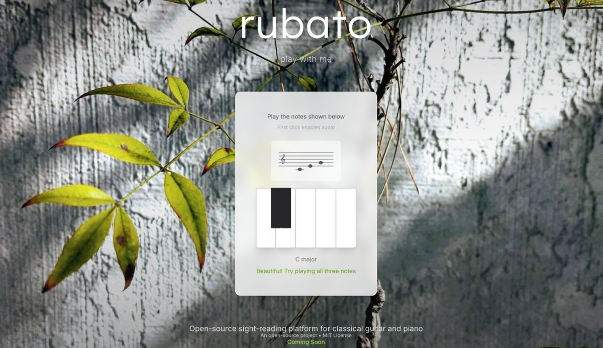

# Mirubato: Open-Source Multi-Instrument Sight-Reading Platform



## Project Overview
An open-source progressive web application focused on sight-reading practice for classical guitar and piano, featuring email authentication, deployable as a full-stack application on Cloudflare Workers.

## ✨ Features

- **Multi-Instrument Support**: Classical guitar and piano sight-reading
- **Interactive Audio**: High-quality instrument samples powered by Tone.js
- **Educational Focus**: Based on proven sight-reading pedagogies
- **Progressive Difficulty**: Adaptive learning system
- **Open Source**: MIT license with open educational resources
- **Mobile-First**: Responsive design optimized for practice on any device

## 🚀 Quick Start

```bash
# Install dependencies
npm install

# Start development server
npm run dev

# Build for production
npm run build

# Deploy to Cloudflare Workers
npm run deploy
```

## 🎵 Educational Foundation

Mirubato integrates open educational resources:

- **Sight-Reading for Guitar: The Keep Going Method** (CC BY 4.0)
- **IMSLP Public Domain Classical Repertoire** 
- **Research-Based Pedagogical Approaches**

## 🛠 Technology Stack

- **Frontend**: React 18+ with TypeScript, Vite, Tailwind CSS
- **Audio**: Tone.js for professional-grade Web Audio synthesis
- **Music Notation**: VexFlow.js for accurate musical notation rendering
- **Backend**: Cloudflare Workers with D1 database
- **Authentication**: Magic link email authentication with JWT
- **Deployment**: Cloudflare Workers with static assets

## 📚 Documentation

- **[Development Setup](docs/DEVELOPMENT_SETUP.md)** - Get started with local development
- **[Development Guidelines](docs/DEVELOPMENT_GUIDELINES.md)** - Code standards and best practices
- **[Infrastructure](docs/INFRASTRUCTURE.md)** - Architecture and deployment setup
- **[Deployment Guide](docs/DEPLOYMENT_GUIDE.md)** - Step-by-step deployment instructions
- **[Roadmap](docs/ROADMAP.md)** - Development phases and feature planning
- **[License](docs/LICENSE.md)** - MIT license and content attribution

## 🎯 Current Status: Phase 1 - Foundation

✅ **Completed:**
- Landing page with interactive piano interface
- Nature-inspired design system implementation
- Tone.js audio integration with browser security handling
- Tailwind CSS responsive design framework
- Project structure and build pipeline

🔄 **In Progress:**
- User authentication system
- VexFlow music notation integration
- Practice session management

## 🌟 Getting Involved

Mirubato is built for the open-source music education community. We welcome contributions from:

- **Developers**: Frontend, backend, and audio programming
- **Music Educators**: Pedagogical guidance and content review
- **Musicians**: User testing and feedback
- **Designers**: UI/UX improvements and accessibility

## 📄 License

MIT License - see [LICENSE.md](docs/LICENSE.md) for details.

Educational content is licensed under CC BY 4.0 and includes proper attribution to original creators.

## 🎼 About the Project

Mirubato aims to democratize sight-reading education by providing high-quality, open-source tools for classical guitar and piano students worldwide. The platform emphasizes the "Keep Going Method" - continuous reading without stopping for mistakes - which has proven effective in developing fluent sight-reading skills.

---

**Live Demo**: Coming soon at [mirubato.com](https://mirubato.com)  
**Repository**: [github.com/arbeitandy/mirubato](https://github.com/arbeitandy/mirubato)