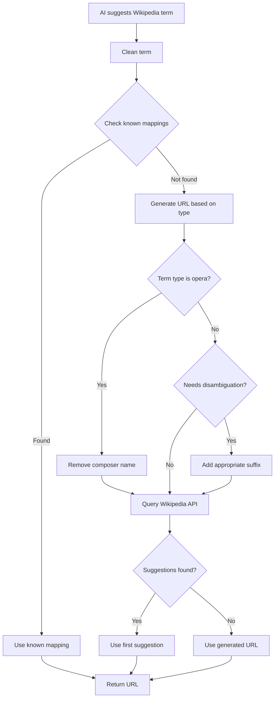

# Wikipedia URL Generation for Music Terms

## Overview

This document describes the improved Wikipedia URL generation system for the music dictionary, addressing the issue where AI-generated Wikipedia links were producing 404 errors due to incorrect formatting (e.g., "The_Magic_Flute_Mozart" instead of "The_Magic_Flute").

## Problem Statement

The AI was generating Wikipedia URLs with unnecessary suffixes, particularly:

- Adding composer names to opera titles (e.g., "The_Magic_Flute_Mozart")
- Incorrect disambiguation patterns
- Not following Wikipedia's naming conventions for music articles

## Solution Architecture

### 1. Wikipedia URL Utilities (`src/utils/wikipedia-url.ts`)

A comprehensive utility module that provides:

- **URL Generation**: Smart generation based on term type and Wikipedia conventions
- **OpenSearch API Integration**: Fetches actual Wikipedia suggestions
- **URL Validation**: Checks if generated URLs are valid
- **Pattern Recognition**: Knows when to add disambiguation suffixes

### 2. Key Features

#### Smart Disambiguation

```typescript
// Automatically adds (music) only when needed
generateWikipediaUrl('Scale', 'theory') // → Scale_(music)
generateWikipediaUrl('Allegro', 'tempo') // → Allegro (no disambiguation)
```

#### Opera Title Cleaning

```typescript
// Removes composer names from opera titles
generateWikipediaUrl('The Magic Flute', 'opera', 'The Magic Flute Mozart')
// → https://en.wikipedia.org/wiki/The_Magic_Flute
```

#### Known Mappings

The system maintains a database of known Wikipedia titles for common music terms:

- Opera titles (e.g., "La traviata" with lowercase 't')
- Composer names
- Music theory terms

### 3. AI Prompt Improvements

Updated the reference extraction prompt to provide clearer guidelines:

```
IMPORTANT Wikipedia Guidelines:
- For operas: Use just the title WITHOUT composer name
- For composers: Use full name as is
- For music theory terms: Add (music) ONLY if ambiguous
- For instruments: Usually no disambiguation needed
```

### 4. Wikipedia API Integration

The system now:

1. Generates a best-guess URL based on patterns
2. Queries Wikipedia's OpenSearch API for suggestions
3. Uses the first suggestion if available
4. Falls back to the generated URL if no suggestions found

## Implementation Details

### URL Generation Flow



### Testing

Comprehensive test suite covers:

- URL generation for different term types
- Disambiguation logic
- API integration (mocked)
- Edge cases and special characters

### Migration Script

A migration script (`scripts/fix-wikipedia-urls.ts`) is provided to:

- Find all existing entries with Wikipedia references
- Generate corrected URLs
- Validate them against Wikipedia
- Update the database

## Usage Examples

### Basic Usage

```typescript
import { generateWikipediaUrl } from './utils/wikipedia-url'

// Simple term
const url1 = generateWikipediaUrl('Mozart', 'composer')
// → https://en.wikipedia.org/wiki/Mozart

// Opera without composer suffix
const url2 = generateWikipediaUrl(
  'Don Giovanni',
  'opera',
  'Don Giovanni Mozart'
)
// → https://en.wikipedia.org/wiki/Don_Giovanni

// Theory term with disambiguation
const url3 = generateWikipediaUrl('Dynamics', 'theory')
// → https://en.wikipedia.org/wiki/Dynamics_(music)
```

### With API Validation

```typescript
import { getWikipediaSuggestions } from './utils/wikipedia-url'

const suggestions = await getWikipediaSuggestions('Bach', 3)
// Returns top 3 Wikipedia article suggestions
```

## Benefits

1. **Accuracy**: Significantly reduces 404 errors for Wikipedia links
2. **Consistency**: Follows Wikipedia's naming conventions
3. **Flexibility**: Handles various music term types appropriately
4. **Validation**: Can verify URLs before storing them
5. **Maintainability**: Easy to add new patterns and mappings

## Future Enhancements

1. **Caching**: Cache Wikipedia API responses to reduce latency
2. **Batch Processing**: Validate multiple URLs in parallel
3. **Language Support**: Extend to non-English Wikipedia editions
4. **Extract Enhancement**: Fetch actual Wikipedia extracts for better previews
5. **Redirect Handling**: Follow Wikipedia redirects to canonical URLs

## References

- [Wikipedia API Documentation](https://www.mediawiki.org/wiki/API:Main_page)
- [Wikipedia Naming Conventions (Music)](<https://en.wikipedia.org/wiki/Wikipedia:Naming_conventions_(music)>)
- [OpenSearch API](https://www.mediawiki.org/wiki/API:Opensearch)
