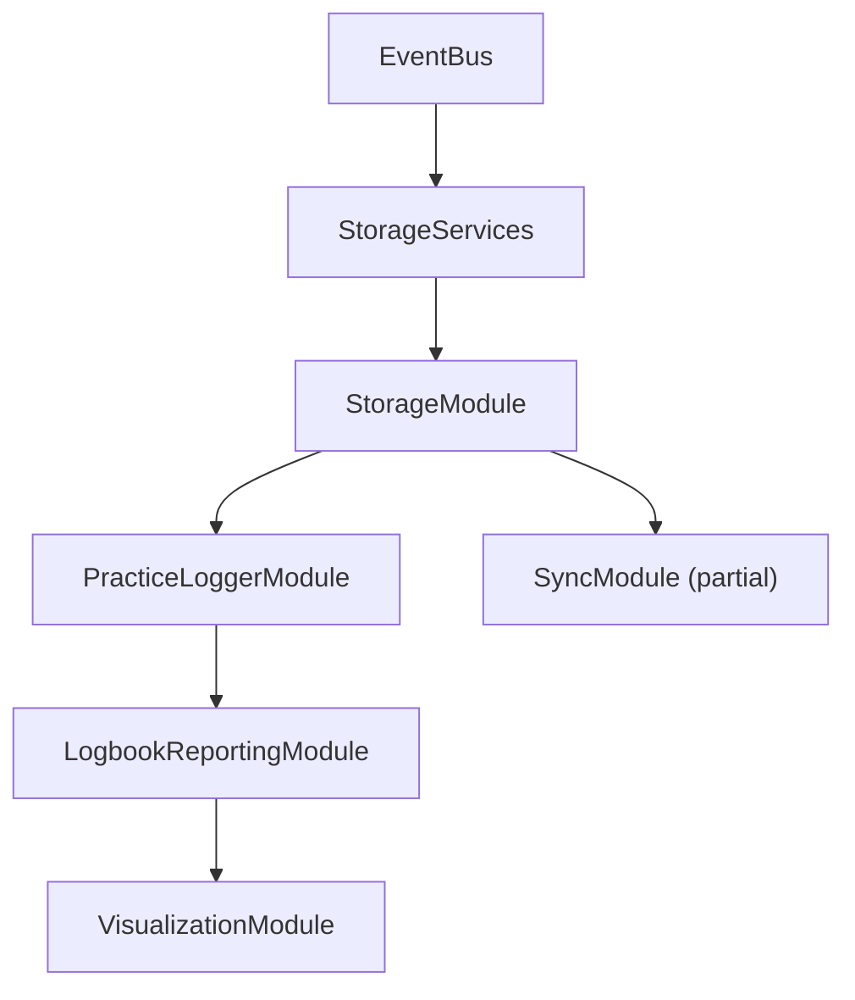

# Rubato Design Document

## Overview

Rubato is a progressive web application for musicians to track and analyze their practice sessions. Currently focused on providing a comprehensive practice logbook with analytics, the application is built with a module-based architecture, event-driven communication, and local-first philosophy. The MVP emphasizes practice logging and reporting, with the sheet music and real-time practice features temporarily phased out for future development.

## Core Design Principles

### 1. Local-First Architecture

- **Offline by default**: All core features work without internet connection
- **Progressive enhancement**: Online features enhance the experience
- **Data ownership**: Users control their practice data
- **Instant responsiveness**: No network latency for core interactions

### 2. Module-Based Architecture

- **Separation of concerns**: Each module handles a specific domain
- **Event-driven communication**: Modules communicate via EventBus
- **Dependency injection**: Clear initialization order and dependencies
- **Testable**: Each module can be tested in isolation

### 3. Minimalist UI Philosophy

- **Ghost controls**: 5% opacity when not in use
- **Progressive disclosure**: Show only what's needed
- **Focus on content**: Sheet music is the primary visual element
- **Responsive design**: Adapts to device and orientation

## System Architecture

### Module Overview

```typescript
interface ModuleInterface {
  name: string
  version: string
  dependencies: string[]

  initialize(): Promise<void>
  shutdown(): Promise<void>
  getHealth(): Promise<ModuleHealth>

  // Event handling
  on(event: string, handler: EventHandler): void
  off(event: string, handler: EventHandler): void
  emit(event: string, data: any): void
}
```

### Module Architecture Status

#### Active Modules (MVP Focus)

##### Core Infrastructure

###### 1. **EventBus**

- Central event-driven communication system
- Singleton pattern with pub/sub architecture
- Type-safe event system with generic constraints
- Event history tracking (last 1000 events)
- Wildcard pattern matching for subscriptions
- Debug mode with comprehensive logging
- Automatic error handling and event isolation

###### 2. **Storage Services**

- Abstract storage layer with event-driven capabilities
- `StorageService`: Base interface for all storage operations
- `EventDrivenStorage`: Event-based storage implementation
- `MockStorageService`: Testing implementation
- Request/response pattern for all operations

##### Infrastructure Modules

###### 3. **StorageModule**

- Local storage management with adapter pattern
- LocalStorage adapter (IndexedDB adapter pending)
- TTL support for cached data
- Storage quota management
- Emits: `data:create:*`, `data:read:*`, `data:delete:*`, `data:sync:required`
- Consumes: `storage:request`, `storage:read`, `storage:write`, `storage:delete`

###### 4. **SyncModule**

- **_Sync requirement_**
  - entries in local storage always persists regardless signed in or not.
  - if sign in, bi-direction sync should be triggered and sync local entry to d1 also sync d1 entries to local. Both local and d1 sync should dedup based on entry id.
  - if sign off. the entries should still persist.
  - if user sign in to a new email, all local entries should still be synced to the d1 associated with the new email.
  - later we will implement delete all local storage botton for user to clear up. But uers could also clear up local storage using browser's clear data function
- Data synchronization between local and cloud storage
- Sync queue management with retry logic
- Exponential backoff for failed operations
- Conflict resolution strategies
- Batch sync operations
- Emits: `sync:operation:queued`, `sync:operation:success`, `sync:operation:failed`
- Consumes: `data:sync:required`, `sync:request:initiated`
- Status: Partial implementation

##### Domain Modules

###### 5. **PracticeLoggerModule**

- Professional practice logbook management
- Goal tracking with milestone support
- Practice report generation (daily, weekly, monthly)
- Export functionality (JSON, CSV, PDF pending)
- Auto-tagging based on performance data
- Practice streak calculation
- Emits: `logger:entry:created`, `logger:goal:completed`, `logger:export:ready`
- Consumes: `practice:session:ended`, `progress:milestone:achieved`

###### 6. **LogbookReportingModule**

- Comprehensive analytics for practice logs
- Multiple report views (overview, repertoire, timeline, categories)
- Time-based statistics with minute-level accuracy
- Piece and category analytics
- Universal access (works for anonymous and authenticated users)
- Export functionality (CSV, JSON)
- Emits: `report:generated`, `report:exported`
- Consumes: `logger:entry:*` events for cache invalidation

###### 7. **VisualizationModule**

- Data visualization using Chart.js
- Multiple chart types (line, bar, radar, heatmap, tree)
- Dashboard creation and management
- Export functionality (PNG, SVG, PDF, CSV, JSON)
- Responsive adaptations for different devices
- Accessibility features (ARIA labels, keyboard nav)
- Emits: `visualization:chart:created`, `visualization:exported`
- Consumes: `report:generated` from LogbookReportingModule

#### Phased Out Modules (Preserved for Future)

##### Practice Mode Modules

###### **PracticeSessionModule** (Phase 2)

- Practice session lifecycle management
- Session start/pause/resume/end functionality
- Auto-save with configurable intervals
- Session statistics and performance tracking
- Multi-instrument support
- Status: Phased out, code preserved

###### **SheetMusicLibraryModule** (Phase 2)

- Sheet music library and exercise generation
- Algorithmic exercise generation (sight-reading, technical)
- User repertoire tracking with status management
- Performance history recording
- Exercise metadata and expiration management
- Status: Phased out, generators preserved

###### **PerformanceTrackingModule** (Phase 2)

- Real-time performance analysis
- Note event recording with timing precision
- Performance metrics calculation (accuracy, timing, rhythm)
- Problem area identification
- Real-time feedback generation
- Status: Phased out, not used by current MVP

###### **ProgressAnalyticsModule** (Phase 2)

- Comprehensive analytics and progress tracking
- Progress report generation with visualizations
- Weak area identification algorithms
- Milestone tracking and achievements
- Practice consistency metrics
- Personalized recommendation generation
- Status: Phased out, replaced by LogbookReportingModule for MVP

#### Placeholder Modules (Future Implementation)

##### Multi-Voice Support (Phase 4)

- **SheetMusicLibraryModuleMultiVoice**: Multi-voice sheet music support
- **PerformanceTrackingModuleMultiVoice**: Multi-voice performance tracking
- Status: Placeholder implementation, not actively developed

### Context-Based Services

While not implemented as modules, these services provide essential functionality through React Context:

#### **AuthContext**

- User authentication via magic links
- JWT token management
- User profile and preferences
- Session persistence

#### **AudioContext**

- Audio playback with Tone.js
- Metronome functionality
- MIDI support (future)
- Mobile audio context handling

### Module Communication

#### Event Bus Architecture

```typescript
// Event naming convention: category:action
type EventCategory =
  | 'user' // User-related events
  | 'session' // Practice session events
  | 'sheet' // Sheet music events
  | 'audio' // Audio playback events
  | 'perf' // Performance tracking
  | 'progress' // Progress analytics
  | 'storage' // Storage operations
  | 'sync' // Synchronization events
  | 'error' // Error events

// Event payload structure
interface EventPayload<T = any> {
  timestamp: number
  source: string // Module name
  category: EventCategory
  action: string
  data: T
  metadata?: {
    userId?: string
    sessionId?: string
    correlationId?: string
  }
}
```

#### Module Initialization Order (Current MVP)



#### Event Flow Patterns (Current MVP)

1. **Logbook Flow**:

   - User Action → PracticeLoggerModule → LogbookReportingModule → VisualizationModule

2. **Storage Flow**:

   - All modules → EventDrivenStorage → StorageModule → SyncModule → Cloud (GraphQL)

3. **Analytics Flow**:
   - PracticeLoggerModule → LogbookReportingModule → VisualizationModule
   - LogbookReportingModule generates reports from logged entries

## Data Architecture

### Storage Strategy

#### LocalStorage (Preferences & Settings)

```typescript
interface LocalStorageData {
  userPreferences: {
    theme: 'light' | 'dark' | 'auto'
    instrument: string
    notationSize: number
    autoPageTurn: boolean
    practiceReminders: boolean
  }
  audioSettings: {
    volume: number
    metronomeBeat: number
    metronomeSound: string
  }
  displaySettings: {
    showFingerings: boolean
    showNoteNames: boolean
    colorBlindMode: boolean
  }
}
```

#### IndexedDB (Practice Data)

```typescript
interface IndexedDBStores {
  practiceSession: {
    id: string
    userId: string
    startTime: Date
    endTime?: Date
    sheetMusicId: string
    performance: PerformanceMetrics
    notes: string
  }

  sheetMusic: {
    id: string
    title: string
    composer: string
    measures: Measure[]
    difficulty: number
    metadata: SheetMusicMetadata
  }

  userRepertoire: {
    id: string
    userId: string
    sheetMusicId: string
    status: 'LEARNING' | 'MEMORIZED' | 'FORGOTTEN'
    lastPracticed: Date
    totalMinutes: number
  }

  generatedExercise: {
    id: string
    type: string
    parameters: ExerciseParameters
    measures: Measure[]
    createdAt: Date
  }
}
```

### Data Flow Patterns

#### Practice Session Flow

```
User Action → UI Component → Module → EventBus → Other Modules → Storage
     ↑                                                              ↓
     └──────────────── UI Update ←──────── Event ←─────────────────┘
```

#### Offline/Online Sync

```
Local Change → IndexedDB → Sync Queue → Background Sync → GraphQL API
                   ↓                           ↑              ↓
              Offline Mode                 Online Event    Remote DB
```

## User Experience Design

### Use Cases (Current MVP)

#### Beginner User (Sofia)

- **Profile**: Piano student, practices 15 minutes daily
- **Goals**: Track practice consistency, monitor progress
- **Key Features**:
  - Quick manual entry form
  - Practice streak tracking
  - Visual progress charts
  - Simple reporting interface

#### Professional User (Marcus)

- **Profile**: Jazz guitarist, flexible practice schedule
- **Goals**: Log practice efficiently, analyze patterns
- **Key Features**:
  - Detailed practice logging with tags
  - Repertoire tracking
  - Export capabilities (CSV, JSON)
  - Advanced analytics by category/time

### Practice Page Design

#### Layout Philosophy

- **Content-first**: Sheet music takes 70-80% of screen
- **Ghost controls**: UI elements at 5% opacity until needed
- **Mode-specific**: Different layouts for Practice vs Sight-read
- **Responsive**: Adapts to portrait/landscape and device size

#### Control Hierarchy

**Primary Controls** (Always visible at 5%):

- Play/Pause button
- Tempo adjustment
- Page navigation

**Secondary Controls** (Appear on hover/tap):

- Volume control
- Loop section
- Practice mode toggle

**Tertiary Controls** (In expandable menu):

- Settings
- Export/Share
- Help

#### Interaction Patterns

```css
/* Ghost control implementation */
.control {
  opacity: 0.05;
  transition: opacity 0.2s ease;
}

.control:hover {
  opacity: 0.15;
}

.control.active {
  opacity: 1;
}

/* Full-side tap areas for page navigation */
.page-nav-left {
  position: absolute;
  left: 0;
  width: 15%;
  height: 100%;
  cursor: pointer;
}
```

### Auto Page-Flip Feature

#### Implementation Strategy

1. **Measure Tracking**: MusicPlayer tracks current measure
2. **Page Calculation**: SheetMusicDisplay knows measures per page
3. **Timing Logic**: Flip at 75% through last measure of page
4. **User Override**: Manual flip cancels auto for that page

#### Mobile Adaptations

- **Portrait**: Continuous scroll instead of pages
- **Landscape**: Traditional page view with flip
- **Tablet**: User choice between modes

## Technical Implementation

### Shared Architecture

#### Shared Modules Directory

The `/shared` directory contains cross-platform code that is imported by both frontend and backend, ensuring type safety and code reuse:

```
shared/
├── types/              # Type definitions shared across all packages
│   ├── auth.ts        # Authentication types
│   ├── practice.ts    # Practice session types
│   ├── sheetMusic.ts  # Music notation types
│   ├── user.ts        # User profile types
│   └── index.ts       # Barrel exports
├── utils/              # Shared utility functions
│   ├── validation.ts  # Input validation
│   ├── formatting.ts  # Data formatting
│   └── constants.ts   # Shared constants
├── interfaces/         # Module interfaces
│   ├── module.ts      # Base module interface
│   ├── storage.ts     # Storage service interfaces
│   └── events.ts      # Event system types
└── scripts/           # Build and conversion scripts
    └── musicxml-converter/  # MusicXML processing tools
```

#### Type System Architecture

All types flow from the shared directory to ensure consistency:

```
shared/types (Source of Truth)
    ↓
GraphQL Schema (Uses shared types)
    ↓
Generated GraphQL Types (Auto-generated)
    ↓
Frontend & Backend (Import from shared)
```

This architecture prevents type drift and ensures all parts of the system use identical type definitions.

### Frontend Architecture

#### Technology Stack

- **Framework**: React 18+ with TypeScript
- **State Management**: Module-based with EventBus
- **Styling**: Tailwind CSS with custom components
- **Music Notation**: VexFlow for rendering
- **Audio**: Tone.js for synthesis and playback
- **Build**: Vite for fast development

#### Component Structure

```
src/
├── modules/           # Core business logic
├── components/        # Reusable UI components
├── pages/            # Route-based pages
├── contexts/         # React contexts
├── hooks/            # Custom React hooks
├── utils/            # Utility functions
└── services/         # External service integrations
```

### Backend Architecture

#### Technology Stack

- **Runtime**: Cloudflare Workers (Edge computing)
- **API**: GraphQL with type generation
- **Database**: Cloudflare D1 (SQLite)
- **Storage**: R2 for assets
- **Auth**: Magic links with JWT

#### API Design

```graphql
type Query {
  # User's repertoire with learning status
  userRepertoire(
    status: RepertoireStatus
    limit: Int
    offset: Int
  ): [UserRepertoire!]!

  # AI-powered recommendations
  recommendations(
    type: RecommendationType
    limit: Int
  ): [SheetMusicRecommendation!]!

  # Search with advanced filters
  searchSheetMusic(
    query: String
    filters: SheetMusicFilters
  ): SheetMusicSearchResult!
}

type Mutation {
  # Update repertoire status
  updateRepertoireStatus(
    sheetMusicId: ID!
    status: RepertoireStatus!
  ): UserRepertoire!

  # Generate custom exercise
  generateExercise(
    type: ExerciseType!
    parameters: ExerciseParameters!
  ): GeneratedExercise!
}
```

## Quality Assurance

### Testing Strategy

#### Coverage Requirements

- **Unit Tests**: >80% coverage per module
- **Integration Tests**: Critical user flows
- **E2E Tests**: Key user journeys
- **Performance Tests**: <100ms response times

#### Test Categories

```typescript
// Module tests
describe('PracticeSessionModule', () => {
  it('should emit session:started when practice begins')
  it('should handle pause/resume correctly')
  it('should calculate accurate metrics')
  it('should recover from storage errors')
})

// Component tests
describe('SheetMusicDisplay', () => {
  it('should render measures correctly')
  it('should handle page navigation')
  it('should update on window resize')
  it('should be keyboard accessible')
})
```

### Performance Targets

| Metric              | Target | Critical |
| ------------------- | ------ | -------- |
| Initial Load        | <2s    | <3s      |
| Time to Interactive | <3s    | <5s      |
| API Response        | <100ms | <200ms   |
| Frame Rate          | 60fps  | 30fps    |
| Memory Usage        | <100MB | <200MB   |

### Accessibility Requirements

- **WCAG 2.1 AA** compliance minimum
- **Keyboard navigation** for all interactive elements
- **Screen reader** announcements for state changes
- **High contrast mode** support
- **Reduced motion** preferences respected

## Security & Privacy

### Data Protection

- **Local encryption** for sensitive data
- **No tracking** without explicit consent
- **Data export** available anytime
- **Account deletion** removes all data

### Authentication Flow

```
User Email → Magic Link → Verify Token → JWT Session → Refresh Token
                ↓                            ↓
           Email Service              Stored Locally
```

## Future Enhancements

### Planned Features

1. **MIDI Integration**: Connect digital instruments
2. **AI Coaching**: Real-time performance feedback
3. **Social Features**: Share progress with teachers
4. **Advanced Analytics**: ML-powered insights

### Extension Points

```typescript
interface PluginAPI {
  registerModule(module: ModuleInterface): void
  registerSheetProcessor(processor: SheetProcessor): void
  registerAudioEffect(effect: AudioEffect): void
  registerAnalyzer(analyzer: PerformanceAnalyzer): void
}
```

## Architecture Phases

### Phase 1: MVP - Logbook Focus (Current)

- **Core functionality**: Practice logging and reporting
- **Active modules**:
  - Core: EventBus, EventDrivenStorage
  - Infrastructure: StorageModule, SyncModule (partial)
  - Domain: PracticeLoggerModule, LogbookReportingModule
  - Visualization: VisualizationModule
- **User flow**: Sign in → Logbook → Reports & Analytics
- **Key features**:
  - Manual practice entry
  - Comprehensive reporting with multiple views
  - Data export (CSV, JSON)
  - Works for both anonymous and authenticated users

### Phase 2: Practice Mode (Phased Out - Future)

- **Sheet music display and playback**
- **Real-time performance tracking**
- **Progress analytics**
- **Modules preserved in codebase**:
  - PracticeSessionModule
  - SheetMusicLibraryModule
  - PerformanceTrackingModule
  - ProgressAnalyticsModule
- **Status**: Code preserved for future reactivation

### Phase 3: Advanced Features (Future)

- **Multi-voice support** (Phase 4 placeholder exists)
- **MIDI integration**
- **AI coaching**
- **Social features**

## Decision Log

### Key Decisions

1. **VexFlow over Canvas** (2024-01)

   - Better music notation support
   - Active community
   - Easier to maintain

2. **Module Architecture** (2024-02)

   - Clear separation of concerns
   - Easier testing
   - Better code organization

3. **Local-First Approach** (2024-02)

   - Better performance
   - Works offline
   - User owns their data

4. **Magic Links over Passwords** (2024-03)

   - Simpler UX
   - More secure
   - No password management

5. **Event-Driven Communication** (2024-03)

   - Loose coupling
   - Easy to extend
   - Better debugging

6. **MVP Simplification** (2025-01)
   - Focus on Logbook functionality
   - Phase out Practice mode temporarily
   - Preserve code for future reactivation
   - Reduce complexity for faster iteration

---

This design document represents the current state of Rubato's architecture and will continue to evolve as the application grows.
