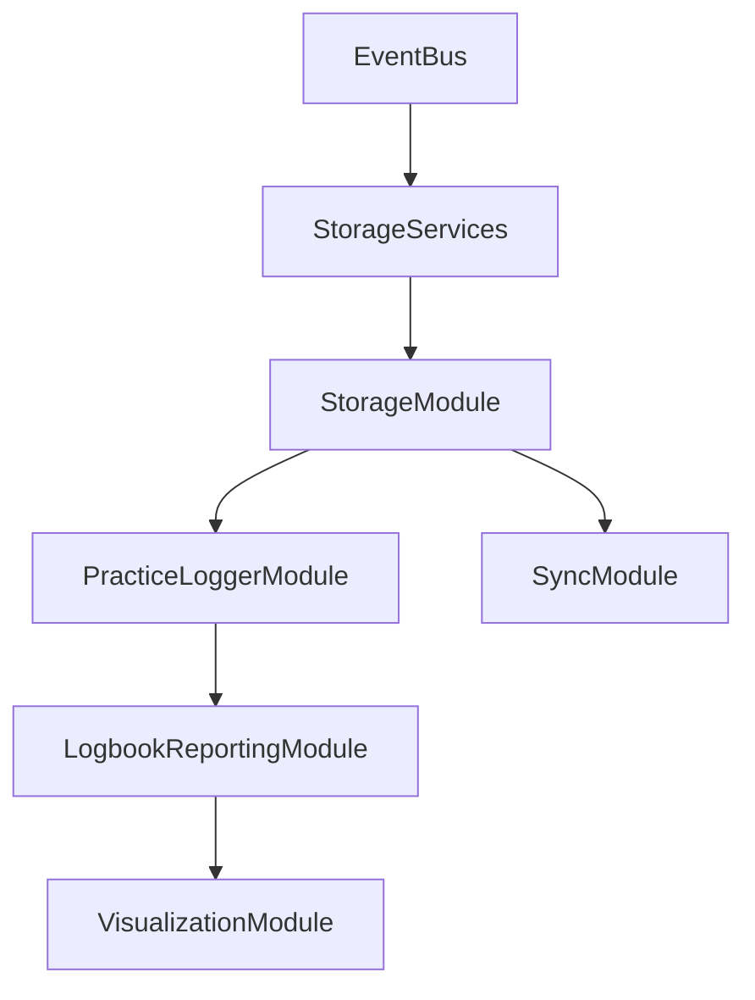

# Mirubato Architecture Design

## Overview

Mirubato (formerly Rubato) is a sight-reading practice application for musicians, built on Cloudflare's edge infrastructure. The application helps users improve their music reading skills through interactive practice sessions with real-time feedback.

## Current Architecture (2025)

### Infrastructure

All services run as Cloudflare Workers with the following domains:

| Service        | Production                     | Staging                                        |
| -------------- | ------------------------------ | ---------------------------------------------- |
| Frontend       | mirubato.com, www.mirubato.com | staging.mirubato.com, www-staging.mirubato.com |
| API            | api.mirubato.com               | api-staging.mirubato.com                       |
| Scores Service | scores.mirubato.com            | scores-staging.mirubato.com                    |

### Services Architecture

```
┌─────────────────────────────────────────────────────────────┐
│                         Frontend                             │
│                   (React + TypeScript)                       │
│                  mirubato / mirubato-staging                 │
└─────────────────────┬───────────────────────────────────────┘
                      │
                      ├─────────────────────────┬──────────────┐
                      │                         │              │
              ┌───────▼────────┐        ┌───────▼────────┐     │
              │     API        │        │ Scores Service │     │
              │    (REST)      │        │     (REST)     │     │
              │ mirubato-api   │        │mirubato-scores │     │
              └───────┬────────┘        └───────┬────────┘     │
                      │                         │              │
                      │                         │              │
              ┌───────▼────────┐        ┌───────▼────────┐     │
              │  D1 Database   │        │  D1 Database   │     │
              │(mirubato-prod) │        │ (scores-prod)  │     │
              └────────────────┘        └────────────────┘     │
```

### Service Details

#### 1. Frontend Service

- **Technology**: React 18, TypeScript, Vite, Tailwind CSS
- **Worker**: Serves static assets via Cloudflare Workers
- **Key Features**:
  - Music notation rendering (VexFlow.js)
  - Audio playback (Tone.js) with lazy loading
  - Real-time practice feedback
  - Offline-first with service workers
  - Module-based architecture with EventBus
  - Optimized bundle with code splitting
  - Comprehensive caching headers for static assets

#### 2. API (REST)

- **Technology**: Hono framework, TypeScript
- **Database**: Cloudflare D1 (SQLite)
- **Purpose**: Core application logic, user management, practice sessions
- **Authentication**: Magic links + JWT tokens + Google OAuth
- **Features**:
  - RESTful design
  - Sync capabilities for offline-first architecture
  - Rate limiting
  - Google OAuth integration
  - Comprehensive health monitoring (/health, /livez, /readyz)
  - JWT validation in health checks
  - Prometheus-compatible metrics endpoint
  - Cloudflare KV caching for improved performance

#### 3. Scores Service

- **Technology**: Hono framework, TypeScript
- **Database**: Separate D1 instance
- **Storage**: Cloudflare R2 for sheet music files
- **Purpose**: Music content management and delivery
- **Features**:
  - Score metadata management
  - Difficulty level tracking
  - Content categorization
  - CDN integration for fast delivery
  - JWT authentication for protected endpoints
  - Edge caching with conditional requests (ETags)
  - Health monitoring with smoke tests
  - Metrics endpoint for observability

### Database Architecture

#### Main Database (API)

The API uses `mirubato-prod` / `mirubato-dev` databases with the following schema:

```sql
-- Users table
users (
  id, email, display_name,
  primary_instrument,
  auth_provider,
  google_id,
  created_at, updated_at
)

-- Practice data tables
practice_sessions, practice_logs, sheet_music,
logbook_entries, goals, user_preferences

-- Sync tables
sync_data, sync_metadata
```

#### Scores Database

Separate database for content management:

```sql
-- Content tables
scores, composers, genres, difficulty_levels,
score_metadata, user_scores
```

### Authentication Flow

1. **Magic Link (Primary)**:
   - User enters email
   - System sends magic link via email
   - Link contains short-lived token
   - Token exchanged for JWT

2. **Google OAuth**:
   - OAuth2 flow with Google
   - Profile data stored in users table
   - Same JWT token system

### Deployment Architecture

- **CI/CD**: GitHub Actions for validation, Cloudflare dashboard for deployment
- **Environments**: Production (default), Staging, Development
- **Worker Names**:
  - Production: `mirubato`, `mirubato-api`, `mirubato-scores`
  - Staging: `*-staging` suffix for each worker
- **Build Process**: Each service built independently from its own directory

### Architecture Status

✅ **Migration Complete**: The system has successfully transitioned to a REST-only architecture:

- GraphQL backend service has been completely removed
- Frontend exclusively uses REST API endpoints
- Database schema unified for REST architecture
- All legacy GraphQL code and dependencies removed

## Core Design Principles

### 1. Local-First Architecture

- **Offline by default**: All core features work without internet connection
- **Progressive enhancement**: Online features enhance the experience
- **Data ownership**: Users control their practice data
- **Instant responsiveness**: No network latency for core interactions

### 2. Module-Based Architecture

- **Separation of concerns**: Each module handles a specific domain
- **Event-driven communication**: Modules communicate via EventBus
- **Dependency injection**: Clear initialization order and dependencies
- **Testable**: Each module can be tested in isolation

### 3. Minimalist UI Philosophy

- **Ghost controls**: 5% opacity when not in use
- **Progressive disclosure**: Show only what's needed
- **Focus on content**: Sheet music is the primary visual element
- **Responsive design**: Adapts to device and orientation

## Frontend Module Architecture

### Module Overview

```typescript
interface ModuleInterface {
  name: string
  version: string
  dependencies: string[]

  initialize(): Promise<void>
  shutdown(): Promise<void>
  getHealth(): Promise<ModuleHealth>

  // Event handling
  on(event: string, handler: EventHandler): void
  off(event: string, handler: EventHandler): void
  emit(event: string, data: any): void
}
```

### Active Modules (MVP Focus)

#### Core Infrastructure

1. **EventBus**: Central event-driven communication system
2. **StorageModule**: Local storage management with adapter pattern
3. **SyncModule**: Data synchronization between local and cloud storage
4. **PracticeLoggerModule**: Professional practice logbook management
5. **LogbookReportingModule**: Comprehensive analytics for practice logs
6. **VisualizationModule**: Data visualization using Chart.js

### Module Communication Flow



## Key Technologies

- **Frontend**: React, TypeScript, Vite, Tailwind CSS, Axios
- **Music**: VexFlow.js (notation), Tone.js (audio), MusicXML support
- **Backend**: Cloudflare Workers, D1 (SQLite), R2 (object storage)
- **Frameworks**: Hono (API, Scores)
- **Auth**: JWT tokens, magic links, Google OAuth

## Performance Considerations

1. **Edge Computing**: All logic runs at Cloudflare edge locations
2. **Database**: D1 provides low-latency SQLite at the edge
3. **Assets**: Static files served via Workers with comprehensive caching:
   - Immutable assets cached for 1 year
   - Images cached for 1 day in browser, 1 year at edge
   - API responses cached for 1 minute at edge
4. **API Response**: Sub-100ms response times globally
5. **Bundle Optimization**:
   - Code splitting reduces initial load by 43%
   - Lazy loading for heavy libraries (Tone.js)
   - Vendor chunks for better caching

## Security

1. **Authentication**: JWT tokens with short expiration
2. **CORS**: Configured per environment
3. **Rate Limiting**: Built into Workers platform
4. **Data Isolation**: User data segregated by user_id foreign keys
5. **Health Check Security**: JWT validation in health endpoints
6. **Auth Middleware**: Consistent authentication across all services

## Health Monitoring

### Endpoints

All services expose comprehensive health monitoring:

- `/health` - Comprehensive health check with all service dependencies
- `/livez` - Liveness probe (simple check that service is running)
- `/readyz` - Readiness probe (check if service can handle requests)
- `/metrics` - Prometheus-compatible metrics endpoint

### Health Check Features

1. **Database connectivity** - Verifies D1 database is accessible
2. **JWT validation** - Tests token creation and verification
3. **Storage access** - Checks R2 bucket connectivity (Scores service)
4. **Cache operations** - Validates KV namespace read/write
5. **Smoke tests** - Runs critical operations to ensure functionality

### Monitoring URLs

- API Health: https://api.mirubato.com/health
- Scores Health: https://scores.mirubato.com/health
- Frontend: Served via static assets, monitored through edge analytics

## Development Workflow

```bash
# Local development
npm run dev              # Frontend (port 3000)
npm run dev:api          # API (port 8787)

# Deployment (from respective directories)
cd [service] && wrangler deploy               # Production
cd [service] && wrangler deploy --env staging # Staging

# Database migrations (from api directory)
cd api && npm run db:migrate:production   # Production
cd api && npm run db:migrate:staging      # Staging
```

## Caching Architecture

### Edge Caching Strategy

Mirubato implements a multi-layer caching strategy leveraging Cloudflare's edge infrastructure:

#### 1. Frontend Asset Caching

```
Static Assets (JS, CSS with hashing): 1 year (immutable)
Images (JPG, PNG, SVG): 1 day browser, 1 year edge
Fonts (WOFF2, TTF): 1 month browser, 1 year edge
HTML: No cache (always fresh)
```

#### 2. API Response Caching

- **Public endpoints**: Cached at edge for 1 minute
- **Authenticated requests**: Never cached
- **Conditional requests**: Support for ETags and 304 responses

#### 3. Scores Service Caching

- **PDFs**: Immutable caching (1 year)
- **Metadata**: 5 minutes at edge
- **KV fallback**: When edge cache misses

### Bundle Optimization

The frontend implements aggressive code splitting:

- **Initial bundle**: Reduced from 631KB to smaller chunks
- **Lazy loading**: Heavy libraries loaded on demand
- **Vendor chunks**: Separate chunks for better caching
  - react-vendor: React ecosystem
  - music-vendor: VexFlow + Tone.js
  - utils-vendor: Utilities and helpers
  - i18n-vendor: Internationalization

## Testing Strategy

### Coverage Requirements

- **Unit Tests**: >80% coverage per module
- **Integration Tests**: Critical user flows
- **E2E Tests**: Key user journeys
- **Performance Tests**: <100ms response times

### Performance Targets

| Metric              | Target | Critical |
| ------------------- | ------ | -------- |
| Initial Load        | <2s    | <3s      |
| Time to Interactive | <3s    | <5s      |
| API Response        | <100ms | <200ms   |
| Frame Rate          | 60fps  | 30fps    |
| Memory Usage        | <100MB | <200MB   |

## Architecture Phases

### Phase 1: MVP - Logbook Focus (Current)

- Core functionality: Practice logging and reporting
- Manual practice entry
- Comprehensive reporting with multiple views
- Data export (CSV, JSON)
- Works for both anonymous and authenticated users

### Phase 2: Practice Mode (Future)

- Sheet music display and playback
- Real-time performance tracking
- Progress analytics
- Modules preserved in codebase for future activation

### Phase 3: Advanced Features (Future)

- Multi-voice support
- MIDI integration
- AI coaching
- Social features

## Future Considerations

1. **Mobile Apps**: React Native using same REST API
2. **Advanced Features**: AI-powered difficulty adjustment
3. **Scaling**: Multi-region database replication
4. **Performance**: Edge caching optimization

---

This design document represents the current state of Mirubato's architecture and will continue to evolve as the application grows.
