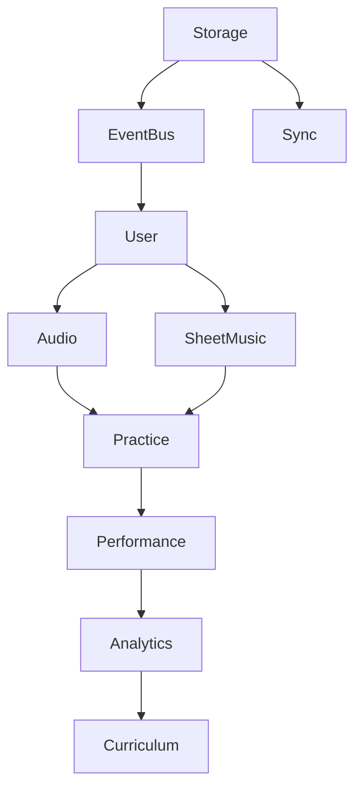

# Rubato Design Document

## Overview

Rubato is a progressive web application for musicians to practice sight-reading and improve their musical skills. Built with a module-based architecture, event-driven communication, and local-first philosophy, it provides a seamless practice experience across devices.

## Core Design Principles

### 1. Local-First Architecture

- **Offline by default**: All core features work without internet connection
- **Progressive enhancement**: Online features enhance the experience
- **Data ownership**: Users control their practice data
- **Instant responsiveness**: No network latency for core interactions

### 2. Module-Based Architecture

- **Separation of concerns**: Each module handles a specific domain
- **Event-driven communication**: Modules communicate via EventBus
- **Dependency injection**: Clear initialization order and dependencies
- **Testable**: Each module can be tested in isolation

### 3. Minimalist UI Philosophy

- **Ghost controls**: 5% opacity when not in use
- **Progressive disclosure**: Show only what's needed
- **Focus on content**: Sheet music is the primary visual element
- **Responsive design**: Adapts to device and orientation

## System Architecture

### Module Overview

```typescript
interface ModuleInterface {
  name: string
  version: string
  dependencies: string[]

  initialize(): Promise<void>
  shutdown(): Promise<void>
  getHealth(): Promise<ModuleHealth>

  // Event handling
  on(event: string, handler: EventHandler): void
  off(event: string, handler: EventHandler): void
  emit(event: string, data: any): void
}
```

### Core Modules

#### 1. **User Management Module**

- Handles authentication via magic links
- Manages user preferences and settings
- Stores user profile data
- Emits: `user:login`, `user:logout`, `user:updated`

#### 2. **Practice Session Module**

- Tracks practice sessions with start/stop/pause
- Records practice metrics and performance
- Manages session templates and goals
- Emits: `session:started`, `session:ended`, `session:paused`

#### 3. **Sheet Music Module**

- Generates exercises algorithmically
- Manages music library and repertoire
- Tracks learning status (Learning, Memorized, Forgotten)
- Imports/exports MusicXML
- Emits: `sheetMusic:loaded`, `exercise:generated`

#### 4. **Audio Engine Module**

- Handles audio playback with Tone.js
- Manages metronome and backing tracks
- Records practice audio (future)
- Emits: `audio:started`, `audio:stopped`, `note:played`

#### 5. **Performance Tracking Module**

- Analyzes practice performance in real-time
- Identifies problem areas and patterns
- Tracks accuracy and timing metrics
- Emits: `performance:analyzed`, `mistake:detected`

#### 6. **Progress Analytics Module**

- Generates practice insights and reports
- Tracks long-term progress trends
- Identifies strengths and weaknesses
- Emits: `progress:calculated`, `milestone:achieved`

#### 7. **Curriculum Module**

- Manages learning paths and goals
- Recommends next pieces to learn
- Adapts to user progress
- Emits: `curriculum:updated`, `goal:completed`

#### 8. **Infrastructure Modules**

- **Storage Module**: Handles IndexedDB and LocalStorage
- **Sync Module**: Manages offline/online data sync
- **Logger Module**: Centralized error and event logging

### Module Communication

#### Event Bus Architecture

```typescript
// Event naming convention: category:action
type EventCategory =
  | 'user' // User-related events
  | 'session' // Practice session events
  | 'sheet' // Sheet music events
  | 'audio' // Audio playback events
  | 'perf' // Performance tracking
  | 'progress' // Progress analytics
  | 'storage' // Storage operations
  | 'sync' // Synchronization events
  | 'error' // Error events

// Event payload structure
interface EventPayload<T = any> {
  timestamp: number
  source: string // Module name
  category: EventCategory
  action: string
  data: T
  metadata?: {
    userId?: string
    sessionId?: string
    correlationId?: string
  }
}
```

#### Module Initialization Order



## Data Architecture

### Storage Strategy

#### LocalStorage (Preferences & Settings)

```typescript
interface LocalStorageData {
  userPreferences: {
    theme: 'light' | 'dark' | 'auto'
    instrument: string
    notationSize: number
    autoPageTurn: boolean
    practiceReminders: boolean
  }
  audioSettings: {
    volume: number
    metronomeBeat: number
    metronomeSound: string
  }
  displaySettings: {
    showFingerings: boolean
    showNoteNames: boolean
    colorBlindMode: boolean
  }
}
```

#### IndexedDB (Practice Data)

```typescript
interface IndexedDBStores {
  practiceSession: {
    id: string
    userId: string
    startTime: Date
    endTime?: Date
    sheetMusicId: string
    performance: PerformanceMetrics
    notes: string
  }

  sheetMusic: {
    id: string
    title: string
    composer: string
    measures: Measure[]
    difficulty: number
    metadata: SheetMusicMetadata
  }

  userRepertoire: {
    id: string
    userId: string
    sheetMusicId: string
    status: 'LEARNING' | 'MEMORIZED' | 'FORGOTTEN'
    lastPracticed: Date
    totalMinutes: number
  }

  generatedExercise: {
    id: string
    type: string
    parameters: ExerciseParameters
    measures: Measure[]
    createdAt: Date
  }
}
```

### Data Flow Patterns

#### Practice Session Flow

```
User Action → UI Component → Module → EventBus → Other Modules → Storage
     ↑                                                              ↓
     └──────────────── UI Update ←──────── Event ←─────────────────┘
```

#### Offline/Online Sync

```
Local Change → IndexedDB → Sync Queue → Background Sync → GraphQL API
                   ↓                           ↑              ↓
              Offline Mode                 Online Event    Remote DB
```

## User Experience Design

### Use Cases

#### Beginner User (Sofia)

- **Profile**: Piano student, practices 15 minutes daily
- **Goals**: Build sight-reading skills, track progress
- **Key Features**:
  - Structured daily exercises
  - Visual progress tracking
  - Gamification elements
  - Simple, guided interface

#### Professional User (Marcus)

- **Profile**: Jazz guitarist, flexible practice schedule
- **Goals**: Log practice efficiently, analyze patterns
- **Key Features**:
  - Detailed practice logging
  - Custom exercise generation
  - Export capabilities
  - Advanced analytics

### Practice Page Design

#### Layout Philosophy

- **Content-first**: Sheet music takes 70-80% of screen
- **Ghost controls**: UI elements at 5% opacity until needed
- **Mode-specific**: Different layouts for Practice vs Sight-read
- **Responsive**: Adapts to portrait/landscape and device size

#### Control Hierarchy

**Primary Controls** (Always visible at 5%):

- Play/Pause button
- Tempo adjustment
- Page navigation

**Secondary Controls** (Appear on hover/tap):

- Volume control
- Loop section
- Practice mode toggle

**Tertiary Controls** (In expandable menu):

- Settings
- Export/Share
- Help

#### Interaction Patterns

```css
/* Ghost control implementation */
.control {
  opacity: 0.05;
  transition: opacity 0.2s ease;
}

.control:hover {
  opacity: 0.15;
}

.control.active {
  opacity: 1;
}

/* Full-side tap areas for page navigation */
.page-nav-left {
  position: absolute;
  left: 0;
  width: 15%;
  height: 100%;
  cursor: pointer;
}
```

### Auto Page-Flip Feature

#### Implementation Strategy

1. **Measure Tracking**: MusicPlayer tracks current measure
2. **Page Calculation**: SheetMusicDisplay knows measures per page
3. **Timing Logic**: Flip at 75% through last measure of page
4. **User Override**: Manual flip cancels auto for that page

#### Mobile Adaptations

- **Portrait**: Continuous scroll instead of pages
- **Landscape**: Traditional page view with flip
- **Tablet**: User choice between modes

## Technical Implementation

### Frontend Architecture

#### Technology Stack

- **Framework**: React 18+ with TypeScript
- **State Management**: Module-based with EventBus
- **Styling**: Tailwind CSS with custom components
- **Music Notation**: VexFlow for rendering
- **Audio**: Tone.js for synthesis and playback
- **Build**: Vite for fast development

#### Component Structure

```
src/
├── modules/           # Core business logic
├── components/        # Reusable UI components
├── pages/            # Route-based pages
├── contexts/         # React contexts
├── hooks/            # Custom React hooks
├── utils/            # Utility functions
└── services/         # External service integrations
```

### Backend Architecture

#### Technology Stack

- **Runtime**: Cloudflare Workers (Edge computing)
- **API**: GraphQL with type generation
- **Database**: Cloudflare D1 (SQLite)
- **Storage**: R2 for assets
- **Auth**: Magic links with JWT

#### API Design

```graphql
type Query {
  # User's repertoire with learning status
  userRepertoire(
    status: RepertoireStatus
    limit: Int
    offset: Int
  ): [UserRepertoire!]!

  # AI-powered recommendations
  recommendations(
    type: RecommendationType
    limit: Int
  ): [SheetMusicRecommendation!]!

  # Search with advanced filters
  searchSheetMusic(
    query: String
    filters: SheetMusicFilters
  ): SheetMusicSearchResult!
}

type Mutation {
  # Update repertoire status
  updateRepertoireStatus(
    sheetMusicId: ID!
    status: RepertoireStatus!
  ): UserRepertoire!

  # Generate custom exercise
  generateExercise(
    type: ExerciseType!
    parameters: ExerciseParameters!
  ): GeneratedExercise!
}
```

## Quality Assurance

### Testing Strategy

#### Coverage Requirements

- **Unit Tests**: >80% coverage per module
- **Integration Tests**: Critical user flows
- **E2E Tests**: Key user journeys
- **Performance Tests**: <100ms response times

#### Test Categories

```typescript
// Module tests
describe('PracticeSessionModule', () => {
  it('should emit session:started when practice begins')
  it('should handle pause/resume correctly')
  it('should calculate accurate metrics')
  it('should recover from storage errors')
})

// Component tests
describe('SheetMusicDisplay', () => {
  it('should render measures correctly')
  it('should handle page navigation')
  it('should update on window resize')
  it('should be keyboard accessible')
})
```

### Performance Targets

| Metric              | Target | Critical |
| ------------------- | ------ | -------- |
| Initial Load        | <2s    | <3s      |
| Time to Interactive | <3s    | <5s      |
| API Response        | <100ms | <200ms   |
| Frame Rate          | 60fps  | 30fps    |
| Memory Usage        | <100MB | <200MB   |

### Accessibility Requirements

- **WCAG 2.1 AA** compliance minimum
- **Keyboard navigation** for all interactive elements
- **Screen reader** announcements for state changes
- **High contrast mode** support
- **Reduced motion** preferences respected

## Security & Privacy

### Data Protection

- **Local encryption** for sensitive data
- **No tracking** without explicit consent
- **Data export** available anytime
- **Account deletion** removes all data

### Authentication Flow

```
User Email → Magic Link → Verify Token → JWT Session → Refresh Token
                ↓                            ↓
           Email Service              Stored Locally
```

## Future Enhancements

### Planned Features

1. **MIDI Integration**: Connect digital instruments
2. **AI Coaching**: Real-time performance feedback
3. **Social Features**: Share progress with teachers
4. **Advanced Analytics**: ML-powered insights

### Extension Points

```typescript
interface PluginAPI {
  registerModule(module: ModuleInterface): void
  registerSheetProcessor(processor: SheetProcessor): void
  registerAudioEffect(effect: AudioEffect): void
  registerAnalyzer(analyzer: PerformanceAnalyzer): void
}
```

## Decision Log

### Key Decisions

1. **VexFlow over Canvas** (2024-01)

   - Better music notation support
   - Active community
   - Easier to maintain

2. **Module Architecture** (2024-02)

   - Clear separation of concerns
   - Easier testing
   - Better code organization

3. **Local-First Approach** (2024-02)

   - Better performance
   - Works offline
   - User owns their data

4. **Magic Links over Passwords** (2024-03)

   - Simpler UX
   - More secure
   - No password management

5. **Event-Driven Communication** (2024-03)
   - Loose coupling
   - Easy to extend
   - Better debugging

---

This design document represents the current state of Rubato's architecture and will continue to evolve as the application grows.
