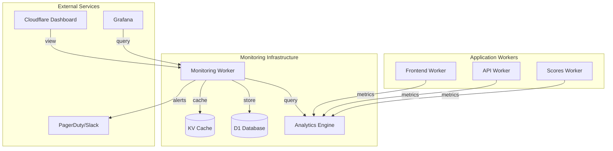

# Monitoring, Alerting, and Cost Analysis for Mirubato

This document outlines the comprehensive monitoring, alerting, and cost analysis infrastructure for Mirubato's Cloudflare Workers deployment.

## Table of Contents

1. [Overview](#overview)
2. [Architecture](#architecture)
3. [Lightweight Monitoring Library](#lightweight-monitoring-library)
4. [Infrastructure Monitoring Worker](#infrastructure-monitoring-worker)
5. [Implementation Guide](#implementation-guide)
6. [Cost Tracking and Analysis](#cost-tracking-and-analysis)
7. [Alert Configuration](#alert-configuration)
8. [Dashboard and Visualization](#dashboard-and-visualization)
9. [Best Practices](#best-practices)

## Overview

Mirubato uses a multi-layered monitoring approach combining:

- **Native Cloudflare Workers Logs** for basic observability (2 lines of config)
- **Workers Analytics Engine** for high-cardinality metrics
- **Custom Infrastructure Monitoring Worker** for aggregation and alerting
- **Lightweight monitoring library** for minimal overhead instrumentation

### Current Workers

1. **Frontend Worker** (`mirubato-frontendv2`) - Static asset serving
2. **API Worker** (`mirubato-api`) - REST API with D1, KV
3. **Scores Worker** (`mirubato-scores`) - PDF rendering with R2, Browser API, AI
4. **Monitoring Worker** (`mirubato-monitoring`) - NEW: Infrastructure monitoring

## Architecture



## Lightweight Monitoring Library

### Design Principles

1. **Minimal Overhead**: < 1ms per metric write
2. **Zero Dependencies**: Uses only native Cloudflare APIs
3. **Type Safe**: Full TypeScript support
4. **Configurable Sampling**: Reduce costs via intelligent sampling

### Core Implementation

Create `/shared/monitoring/index.ts`:

```typescript
// Lightweight monitoring library for Cloudflare Workers
export interface MetricOptions {
  index?: string
  sample?: number // 0-1, percentage to sample
  blobs?: Record<string, string>
  doubles?: Record<string, number>
}

export class Monitor {
  private analyticsEngine: AnalyticsEngineDataset
  private requestId: string
  private invocationStart: number
  private dataPointCount = 0
  private readonly MAX_POINTS_PER_INVOCATION = 25

  constructor(analyticsEngine: AnalyticsEngineDataset, requestId: string) {
    this.analyticsEngine = analyticsEngine
    this.requestId = requestId
    this.invocationStart = Date.now()
  }

  // Track a metric with automatic sampling
  async track(event: string, options: MetricOptions = {}): Promise<void> {
    // Respect the 25 data points per invocation limit
    if (this.dataPointCount >= this.MAX_POINTS_PER_INVOCATION) {
      return
    }

    // Apply sampling
    if (options.sample && Math.random() > options.sample) {
      return
    }

    try {
      const blobs = {
        event,
        requestId: this.requestId,
        ...options.blobs,
      }

      const doubles = {
        ...options.doubles,
      }

      // Index optimization: combine high-cardinality fields
      const index = options.index || event

      this.analyticsEngine.writeDataPoint({
        indexes: [index],
        blobs,
        doubles,
      })

      this.dataPointCount++
    } catch (error) {
      // Fail silently to not impact application
      console.error('Monitoring error:', error)
    }
  }

  // Track request completion with automatic metrics
  async trackRequest(
    status: number,
    responseTime: number,
    metadata: Record<string, any> = {}
  ): Promise<void> {
    const cpuTime = Date.now() - this.invocationStart

    await this.track('request', {
      index: `request:${status >= 500 ? 'error' : status >= 400 ? 'client_error' : 'success'}`,
      blobs: {
        status: status.toString(),
        path: metadata.path || 'unknown',
        method: metadata.method || 'unknown',
        ...metadata,
      },
      doubles: {
        responseTime,
        cpuTime,
        status,
      },
      sample: status >= 500 ? 1 : 0.1, // Always track errors, sample 10% of success
    })
  }

  // Track errors with full context
  async trackError(
    error: Error,
    context: Record<string, any> = {}
  ): Promise<void> {
    await this.track('error', {
      index: `error:${error.name}`,
      blobs: {
        message: error.message.substring(0, 1000), // Limit size
        stack: error.stack?.substring(0, 4000) || '',
        ...context,
      },
      doubles: {
        timestamp: Date.now(),
      },
      sample: 1, // Always track errors
    })
  }

  // Track custom business metrics
  async trackBusiness(
    metric: string,
    value: number,
    dimensions: Record<string, string> = {}
  ): Promise<void> {
    await this.track('business', {
      index: `business:${metric}`,
      blobs: {
        metric,
        ...dimensions,
      },
      doubles: {
        value,
      },
      sample: 0.5, // Sample 50% of business metrics
    })
  }
}

// Helper to create monitor instance
export function createMonitor(
  env: { ANALYTICS: AnalyticsEngineDataset },
  request: Request
): Monitor {
  const requestId = request.headers.get('cf-ray') || crypto.randomUUID()
  return new Monitor(env.ANALYTICS, requestId)
}
```

### Usage Example

```typescript
// In your worker
export default {
  async fetch(request: Request, env: Env): Promise<Response> {
    const monitor = createMonitor(env, request)
    const startTime = Date.now()

    try {
      // Your application logic
      const response = await handleRequest(request)

      // Track the request
      await monitor.trackRequest(response.status, Date.now() - startTime, {
        path: new URL(request.url).pathname,
        method: request.method,
      })

      // Track business metrics
      if (request.url.includes('/api/practice')) {
        await monitor.trackBusiness('practice_session', 1, {
          instrument: 'piano',
        })
      }

      return response
    } catch (error) {
      await monitor.trackError(error as Error, {
        url: request.url,
      })

      return new Response('Internal Server Error', { status: 500 })
    }
  },
}
```

## Infrastructure Monitoring Worker

### Overview

The monitoring worker acts as a central aggregation point for all metrics, providing:

- Real-time metric aggregation
- Historical data storage
- Cost tracking and projections
- Alert management
- Unified API for dashboards

### Configuration: `monitoring/wrangler.toml`

```toml
name = "mirubato-monitoring"
main = "src/index.ts"
compatibility_date = "2024-01-01"
compatibility_flags = ["nodejs_compat"]

[build]
command = "npm run build"

# Routes
routes = [
  { pattern = "monitoring.mirubato.com/*", zone_name = "mirubato.com" }
]

# Cron triggers for periodic tasks
[triggers]
crons = [
  "*/5 * * * *",    # Every 5 minutes: aggregate recent metrics
  "0 * * * *",      # Every hour: calculate costs
  "0 0 * * *",      # Daily: cleanup old data
  "0 6 * * MON"     # Weekly: generate reports
]

# Production environment (default)
vars = {
  ENVIRONMENT = "production",
  ALERT_WEBHOOK_URL = "https://hooks.slack.com/services/xxx",
  PAGERDUTY_KEY = "xxx"
}

# Analytics Engine binding for reading metrics
[[analytics_engine_datasets]]
binding = "ANALYTICS"
dataset = "mirubato_metrics"

# D1 Database for historical data
[[d1_databases]]
binding = "DB"
database_name = "mirubato-monitoring"
database_id = "xxx"

# KV for real-time metrics cache
[[kv_namespaces]]
binding = "METRICS_CACHE"
id = "xxx"

# Queue for async processing
[[queues.producers]]
binding = "ALERT_QUEUE"
queue = "monitoring-alerts"

[[queues.consumers]]
queue = "monitoring-alerts"
max_batch_size = 100
max_batch_timeout = 30

# Durable Objects for stateful aggregation
[[durable_objects.bindings]]
name = "AGGREGATOR"
class_name = "MetricAggregator"

[[migrations]]
tag = "v1"
new_classes = ["MetricAggregator"]

# Service bindings to other workers
[[services]]
binding = "API"
service = "mirubato-api"

[[services]]
binding = "SCORES"
service = "mirubato-scores"

[[services]]
binding = "FRONTEND"
service = "mirubato-frontendv2"

# R2 bucket for report storage
[[r2_buckets]]
binding = "REPORTS"
bucket_name = "mirubato-monitoring-reports"

# Observability
[observability.logs]
enabled = true

# Staging environment
[env.staging]
name = "mirubato-monitoring-staging"
vars = {
  ENVIRONMENT = "staging",
  ALERT_WEBHOOK_URL = "https://hooks.slack.com/services/staging",
  PAGERDUTY_KEY = "staging-key"
}

[[env.staging.analytics_engine_datasets]]
binding = "ANALYTICS"
dataset = "mirubato_metrics_staging"

[[env.staging.d1_databases]]
binding = "DB"
database_name = "mirubato-monitoring-staging"
database_id = "yyy"

[[env.staging.kv_namespaces]]
binding = "METRICS_CACHE"
id = "yyy"

[[env.staging.r2_buckets]]
binding = "REPORTS"
bucket_name = "mirubato-monitoring-reports-staging"

# Local development
[env.local]
vars = {
  ENVIRONMENT = "local",
  ALERT_WEBHOOK_URL = "",
  PAGERDUTY_KEY = ""
}

[env.local.observability.logs]
enabled = false
```

### D1 Schema: `monitoring/schema.sql`

```sql
-- Metrics aggregation tables
CREATE TABLE IF NOT EXISTS metrics_hourly (
  id INTEGER PRIMARY KEY AUTOINCREMENT,
  timestamp DATETIME NOT NULL,
  worker TEXT NOT NULL,
  metric TEXT NOT NULL,
  count INTEGER DEFAULT 0,
  sum REAL DEFAULT 0,
  min REAL,
  max REAL,
  p50 REAL,
  p95 REAL,
  p99 REAL,
  created_at DATETIME DEFAULT CURRENT_TIMESTAMP
);

CREATE INDEX idx_metrics_hourly_timestamp ON metrics_hourly(timestamp);
CREATE INDEX idx_metrics_hourly_worker_metric ON metrics_hourly(worker, metric);

-- Cost tracking
CREATE TABLE IF NOT EXISTS cost_tracking (
  id INTEGER PRIMARY KEY AUTOINCREMENT,
  date DATE NOT NULL,
  worker TEXT NOT NULL,
  resource_type TEXT NOT NULL, -- 'requests', 'cpu_time', 'd1_reads', 'r2_storage', etc
  usage REAL NOT NULL,
  cost_usd REAL NOT NULL,
  created_at DATETIME DEFAULT CURRENT_TIMESTAMP
);

CREATE INDEX idx_cost_tracking_date ON cost_tracking(date);
CREATE INDEX idx_cost_tracking_worker ON cost_tracking(worker);

-- Alert configuration
CREATE TABLE IF NOT EXISTS alert_rules (
  id INTEGER PRIMARY KEY AUTOINCREMENT,
  name TEXT NOT NULL,
  worker TEXT,
  metric TEXT NOT NULL,
  condition TEXT NOT NULL, -- 'greater_than', 'less_than', 'equals'
  threshold REAL NOT NULL,
  window_minutes INTEGER DEFAULT 5,
  severity TEXT DEFAULT 'warning', -- 'info', 'warning', 'critical'
  enabled BOOLEAN DEFAULT 1,
  notification_channels TEXT, -- JSON array of channels
  created_at DATETIME DEFAULT CURRENT_TIMESTAMP,
  updated_at DATETIME DEFAULT CURRENT_TIMESTAMP
);

-- Alert history
CREATE TABLE IF NOT EXISTS alert_history (
  id INTEGER PRIMARY KEY AUTOINCREMENT,
  rule_id INTEGER NOT NULL,
  triggered_at DATETIME NOT NULL,
  resolved_at DATETIME,
  value REAL NOT NULL,
  notification_sent BOOLEAN DEFAULT 0,
  FOREIGN KEY (rule_id) REFERENCES alert_rules(id)
);

-- SLO tracking
CREATE TABLE IF NOT EXISTS slo_definitions (
  id INTEGER PRIMARY KEY AUTOINCREMENT,
  name TEXT NOT NULL,
  worker TEXT NOT NULL,
  target_percentage REAL NOT NULL, -- e.g., 99.9
  window_days INTEGER DEFAULT 30,
  created_at DATETIME DEFAULT CURRENT_TIMESTAMP
);

CREATE TABLE IF NOT EXISTS slo_measurements (
  id INTEGER PRIMARY KEY AUTOINCREMENT,
  slo_id INTEGER NOT NULL,
  date DATE NOT NULL,
  success_count INTEGER DEFAULT 0,
  total_count INTEGER DEFAULT 0,
  FOREIGN KEY (slo_id) REFERENCES slo_definitions(id)
);
```

### Core Monitoring Worker Implementation

```typescript
// monitoring/src/index.ts
import { Monitor } from '../../shared/monitoring'

interface Env {
  ANALYTICS: AnalyticsEngineDataset
  DB: D1Database
  METRICS_CACHE: KVNamespace
  ALERT_QUEUE: Queue
  AGGREGATOR: DurableObjectNamespace
  REPORTS: R2Bucket
  ALERT_WEBHOOK_URL: string
  PAGERDUTY_KEY: string
}

export default {
  async fetch(request: Request, env: Env): Promise<Response> {
    const url = new URL(request.url)

    // API endpoints
    switch (url.pathname) {
      case '/api/metrics':
        return handleMetricsQuery(request, env)
      case '/api/costs':
        return handleCostQuery(request, env)
      case '/api/alerts':
        return handleAlertConfig(request, env)
      case '/api/health':
        return handleHealthCheck(env)
      case '/api/dashboard':
        return handleDashboardData(request, env)
      default:
        return new Response('Not Found', { status: 404 })
    }
  },

  async scheduled(event: ScheduledEvent, env: Env, ctx: ExecutionContext) {
    const monitor = new Monitor(env.ANALYTICS, 'cron-' + Date.now())

    switch (event.cron) {
      case '*/5 * * * *':
        // Aggregate recent metrics every 5 minutes
        ctx.waitUntil(aggregateRecentMetrics(env, monitor))
        break
      case '0 * * * *':
        // Calculate costs every hour
        ctx.waitUntil(calculateHourlyCosts(env, monitor))
        break
      case '0 0 * * *':
        // Daily cleanup
        ctx.waitUntil(cleanupOldData(env, monitor))
        break
      case '0 6 * * MON':
        // Weekly reports
        ctx.waitUntil(generateWeeklyReport(env, monitor))
        break
    }
  },

  async queue(batch: MessageBatch<AlertMessage>, env: Env) {
    // Process alert notifications
    for (const message of batch.messages) {
      await processAlert(message.body, env)
      message.ack()
    }
  },
}

// Aggregate metrics from Analytics Engine
async function aggregateRecentMetrics(env: Env, monitor: Monitor) {
  const fiveMinutesAgo = new Date(Date.now() - 5 * 60 * 1000)

  // Query Analytics Engine for recent metrics
  const query = `
    SELECT 
      blob1 as worker,
      blob2 as event,
      COUNT(*) as count,
      AVG(double1) as avg_response_time,
      MIN(double1) as min_response_time,
      MAX(double1) as max_response_time,
      APPROX_QUANTILE(double1, 0.5) as p50,
      APPROX_QUANTILE(double1, 0.95) as p95,
      APPROX_QUANTILE(double1, 0.99) as p99
    FROM mirubato_metrics
    WHERE timestamp >= ?
    GROUP BY worker, event
  `

  const results = await env.ANALYTICS.query(query, [fiveMinutesAgo])

  // Store in D1 for historical tracking
  const stmt = env.DB.prepare(`
    INSERT INTO metrics_hourly (timestamp, worker, metric, count, sum, min, max, p50, p95, p99)
    VALUES (?, ?, ?, ?, ?, ?, ?, ?, ?, ?)
  `)

  const batch = []
  for (const row of results) {
    batch.push(
      stmt.bind(
        new Date().toISOString(),
        row.worker,
        row.event,
        row.count,
        row.avg_response_time * row.count,
        row.min_response_time,
        row.max_response_time,
        row.p50,
        row.p95,
        row.p99
      )
    )
  }

  await env.DB.batch(batch)

  // Check for alerts
  await checkAlertRules(env, results)
}

// Calculate costs based on usage
async function calculateHourlyCosts(env: Env, monitor: Monitor) {
  const costs = {
    requests: 0.15 / 1_000_000, // $0.15 per million requests
    cpu_time: 0.02 / 1_000_000, // $0.02 per million CPU milliseconds
    d1_reads: 0.001 / 1_000_000, // $0.001 per million D1 reads
    d1_writes: 1.0 / 1_000_000, // $1.00 per million D1 writes
    r2_storage: 0.015 / 1_000_000_000, // $0.015 per GB-month
    r2_operations: 0.36 / 1_000_000, // $0.36 per million operations
    analytics_writes: 0.25 / 1_000_000, // $0.25 per million writes
    analytics_queries: 0.001, // $0.001 per query
  }

  // Query usage metrics
  const usage = await getHourlyUsage(env)

  // Calculate and store costs
  const batch = []
  for (const [resource, amount] of Object.entries(usage)) {
    const cost = amount * (costs[resource] || 0)

    batch.push(
      env.DB.prepare(
        `
      INSERT INTO cost_tracking (date, worker, resource_type, usage, cost_usd)
      VALUES (?, ?, ?, ?, ?)
    `
      ).bind(
        new Date().toISOString().split('T')[0],
        'all', // Aggregate for now, can be per-worker later
        resource,
        amount,
        cost
      )
    )
  }

  await env.DB.batch(batch)

  // Alert if costs are trending high
  const dailyCost =
    Object.values(usage).reduce(
      (sum, amount, idx) => sum + amount * Object.values(costs)[idx],
      0
    ) * 24

  if (dailyCost > 10) {
    // Alert if daily cost exceeds $10
    await env.ALERT_QUEUE.send({
      type: 'cost_alert',
      severity: 'warning',
      message: `Daily cost projection: $${dailyCost.toFixed(2)}`,
    })
  }
}
```

## Implementation Guide

### Step 1: Add Monitoring to Existing Workers

Update each worker's `wrangler.toml`:

```toml
# Add Analytics Engine binding
[[analytics_engine_datasets]]
binding = "ANALYTICS"
dataset = "mirubato_metrics"

# Enable observability logs
[observability.logs]
enabled = true
```

### Step 2: Instrument Your Code

Update worker entry points:

```typescript
// api/src/index.ts
import { createMonitor } from '../../shared/monitoring'

export default {
  async fetch(request: Request, env: Env): Promise<Response> {
    const monitor = createMonitor(env, request)
    const startTime = Date.now()

    try {
      const response = await handleRequest(request, env)

      await monitor.trackRequest(response.status, Date.now() - startTime, {
        path: new URL(request.url).pathname,
        method: request.method,
        worker: 'api',
      })

      return response
    } catch (error) {
      await monitor.trackError(error as Error, {
        worker: 'api',
        url: request.url,
      })

      return new Response('Internal Server Error', { status: 500 })
    }
  },
}
```

### Step 3: Deploy Monitoring Worker

```bash
# Create monitoring worker directory
mkdir monitoring
cd monitoring

# Initialize package.json
npm init -y
npm install --save-dev @cloudflare/workers-types typescript wrangler

# Copy shared monitoring library
cp -r ../shared/monitoring ./src/lib/

# Deploy
wrangler deploy

# Run database migrations
wrangler d1 execute mirubato-monitoring --file=./schema.sql
```

## Cost Tracking and Analysis

### Cost Optimization Strategies

1. **Intelligent Sampling**
   - Sample 10% of successful requests
   - Sample 100% of errors
   - Sample 50% of business metrics

2. **Data Retention**
   - Raw metrics: 7 days
   - Hourly aggregates: 30 days
   - Daily summaries: 1 year

3. **Query Optimization**
   - Use appropriate indexes in Analytics Engine
   - Batch queries where possible
   - Cache frequently accessed data in KV

### Cost Projections

The monitoring worker provides cost projections via:

```bash
# Get current month's costs
curl https://monitoring.mirubato.com/api/costs?period=month

# Get cost breakdown by resource
curl https://monitoring.mirubato.com/api/costs?breakdown=true

# Get cost trends
curl https://monitoring.mirubato.com/api/costs?trend=7d
```

## Alert Configuration

### Built-in Alert Rules

```typescript
// Example alert configurations
const defaultAlerts = [
  {
    name: 'High Error Rate',
    metric: 'error_rate',
    condition: 'greater_than',
    threshold: 0.01, // 1%
    window_minutes: 5,
    severity: 'critical',
  },
  {
    name: 'High Response Time',
    metric: 'response_time_p95',
    condition: 'greater_than',
    threshold: 1000, // 1 second
    window_minutes: 10,
    severity: 'warning',
  },
  {
    name: 'Low Success Rate',
    metric: 'success_rate',
    condition: 'less_than',
    threshold: 0.999, // 99.9%
    window_minutes: 15,
    severity: 'warning',
  },
  {
    name: 'Queue Depth High',
    metric: 'queue_depth',
    condition: 'greater_than',
    threshold: 1000,
    window_minutes: 5,
    severity: 'warning',
  },
]
```

### Alert Channels

Configure multiple notification channels:

```typescript
// Slack webhook
await sendSlackAlert({
  channel: '#alerts',
  severity: 'critical',
  title: 'High Error Rate Detected',
  message: 'API error rate is 5.2% (threshold: 1%)',
  fields: {
    Worker: 'api',
    'Time Window': '5 minutes',
    'Affected Requests': '521',
  },
})

// PagerDuty integration
await createPagerDutyIncident({
  severity: 'critical',
  summary: 'High Error Rate on API Worker',
  details: alertDetails,
})
```

## Dashboard and Visualization

### Grafana Integration

1. **Add Grafana Data Source**:

   ```yaml
   apiVersion: 1
   datasources:
     - name: Mirubato Monitoring
       type: prometheus # Use Prometheus compatibility layer
       url: https://monitoring.mirubato.com/api/prometheus
       jsonData:
         httpMethod: POST
       secureJsonData:
         apiKey: $MONITORING_API_KEY
   ```

2. **Example Dashboard Queries**:

   ```sql
   -- Request rate
   SELECT
     toStartOfMinute(timestamp) as time,
     COUNT(*) as requests_per_minute
   FROM metrics
   WHERE event = 'request'
   GROUP BY time
   ORDER BY time DESC

   -- Error rate
   SELECT
     toStartOfMinute(timestamp) as time,
     SUM(CASE WHEN status >= 500 THEN 1 ELSE 0 END) / COUNT(*) as error_rate
   FROM metrics
   WHERE event = 'request'
   GROUP BY time
   ORDER BY time DESC

   -- P95 response time
   SELECT
     toStartOfMinute(timestamp) as time,
     APPROX_QUANTILE(response_time, 0.95) as p95_response_time
   FROM metrics
   WHERE event = 'request'
   GROUP BY time
   ORDER BY time DESC
   ```

### Custom Dashboard API

The monitoring worker exposes a dashboard API:

```typescript
// GET /api/dashboard
{
  "summary": {
    "total_requests": 1234567,
    "error_rate": 0.001,
    "avg_response_time": 45,
    "active_alerts": 0
  },
  "workers": {
    "api": {
      "requests_per_second": 10.5,
      "error_rate": 0.0005,
      "p95_response_time": 89
    },
    "scores": {
      "requests_per_second": 2.1,
      "error_rate": 0.002,
      "p95_response_time": 1250,
      "queue_depth": 45
    }
  },
  "costs": {
    "today": 2.45,
    "month_to_date": 45.67,
    "projection": 89.12
  },
  "alerts": []
}
```

## Best Practices

### 1. Sampling Strategy

```typescript
// Adaptive sampling based on traffic
function getSampleRate(requestsPerMinute: number): number {
  if (requestsPerMinute < 100) return 1.0 // Sample everything
  if (requestsPerMinute < 1000) return 0.5 // Sample 50%
  if (requestsPerMinute < 10000) return 0.1 // Sample 10%
  return 0.01 // Sample 1%
}
```

### 2. Index Optimization

```typescript
// Good: Compound index for related queries
const index = `${worker}:${event}:${status}`

// Bad: High cardinality without structure
const index = userId // Could have millions of values
```

### 3. Error Handling

```typescript
// Always wrap monitoring code in try-catch
try {
  await monitor.track('event', {
    /* options */
  })
} catch (error) {
  // Log but don't throw - monitoring should never break the app
  console.error('Monitoring error:', error)
}
```

### 4. Resource Limits

- Keep indexes under 96 bytes
- Limit blob data to 5KB total
- Maximum 25 data points per request
- Use queues for batch processing

### 5. Cost Management

- Monitor Analytics Engine query costs
- Use appropriate data retention policies
- Aggregate old data before deletion
- Cache expensive queries in KV

## Migration Path

### Phase 1: Basic Monitoring (Week 1)

1. Deploy monitoring library to shared folder
2. Add Analytics Engine bindings to all workers
3. Instrument basic request/response tracking
4. Enable Cloudflare Logs

### Phase 2: Infrastructure Worker (Week 2)

1. Deploy monitoring worker
2. Set up D1 database
3. Configure cron jobs for aggregation
4. Implement basic alerting

### Phase 3: Advanced Features (Week 3)

1. Add custom business metrics
2. Implement cost tracking
3. Set up Grafana dashboards
4. Configure PagerDuty integration

### Phase 4: Optimization (Week 4)

1. Fine-tune sampling rates
2. Optimize query performance
3. Implement data archival
4. Add predictive alerting

## Conclusion

This monitoring infrastructure provides:

- **Minimal overhead**: < 1ms per request
- **Comprehensive visibility**: All workers and resources
- **Cost effectiveness**: Intelligent sampling and retention
- **Actionable alerts**: Multi-channel notifications
- **Future proof**: Scalable architecture

The total estimated cost for monitoring 10M requests/month:

- Analytics Engine writes: ~$2.50
- D1 storage and queries: ~$1.00
- Worker invocations: ~$1.50
- **Total: ~$5/month**

This investment provides enterprise-grade observability at a fraction of traditional monitoring costs.
