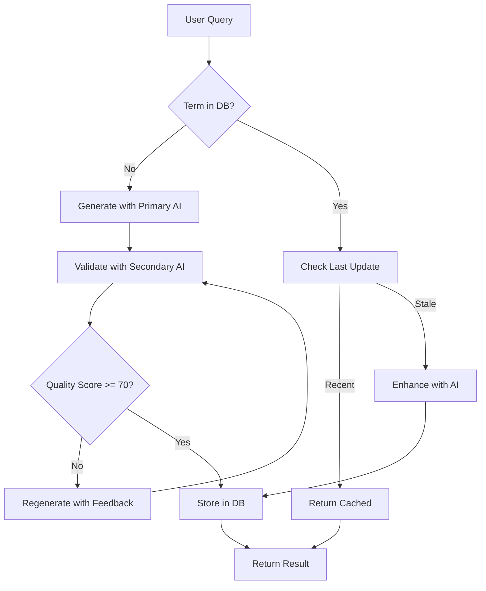

# Music Dictionary Service - Product Requirements Document

## Executive Summary

The Music Dictionary Service is a new Cloudflare Worker module designed to provide comprehensive, AI-powered definitions and references for music-related terms. The service leverages AI models for content generation with a quality verification system, progressive enhancement through continuous learning, and durable caching for optimal performance and cost efficiency.

### Key Features

- AI-powered music term definitions with quality verification
- Multi-source reference aggregation (Wikipedia, books, stores, streaming)
- Progressive quality improvement through continuous learning
- Efficient caching with D1 storage
- Batch processing and full dictionary export capabilities
- Affiliate link support for monetization

## Architecture Overview

```
┌─────────────────────────────────────────────────────────────┐
│                     API Gateway                              │
│                (dictionary.mirubato.com)                     │
└─────────────────┬───────────────────────────────────────────┘
                  │
┌─────────────────▼───────────────────────────────────────────┐
│              Dictionary Worker Service                       │
│                                                              │
│  ┌──────────────┐  ┌──────────────┐  ┌──────────────────┐ │
│  │   Request    │  │   Quality    │  │   Reference      │ │
│  │   Handler    │  │   Scorer     │  │   Aggregator     │ │
│  └──────┬───────┘  └──────┬───────┘  └──────┬───────────┘ │
│         │                  │                  │             │
│  ┌──────▼───────────────────▼─────────────────▼──────────┐ │
│  │                  AI Service Layer                      │ │
│  │  ┌────────────┐  ┌────────────┐  ┌────────────────┐  │ │
│  │  │ Definition │  │ Validation │  │   Enhancement  │  │ │
│  │  │ Generator  │  │   Model    │  │     Model      │  │ │
│  │  └────────────┘  └────────────┘  └────────────────┘  │ │
│  └────────────────────────┬──────────────────────────────┘ │
│                           │                                  │
│  ┌────────────────────────▼──────────────────────────────┐ │
│  │                   Storage Layer                        │ │
│  │  ┌────────────┐  ┌────────────┐  ┌────────────────┐  │ │
│  │  │ D1 Database│  │ KV Cache   │  │  R2 Storage    │  │ │
│  │  │(Definitions)│  │(Hot Cache) │  │ (Media/Docs)   │  │ │
│  │  └────────────┘  └────────────┘  └────────────────┘  │ │
│  └────────────────────────────────────────────────────────┘ │
└─────────────────────────────────────────────────────────────┘
```

## AI Model Research & Recommendations

### 1. Cloudflare AI Workers (Recommended for Primary Use)

**Models:**

- **Llama 3.1 8B Instruct** (Primary Definition Generator)
  - Cost: $0.04 per 1M input tokens, $0.04 per 1M output tokens
  - Latency: ~500ms
  - Quality: Excellent for structured content generation
  - Rate Limit: 1000 requests/minute

- **Mistral 7B Instruct v0.2** (Validation Model)
  - Cost: $0.02 per 1M tokens
  - Latency: ~300ms
  - Quality: Good for verification tasks
  - Rate Limit: 1000 requests/minute

**Advantages:**

- Native Cloudflare integration (no external API calls)
- Low latency (edge deployment)
- Cost-effective for high volume
- No API key management

### 2. OpenAI GPT-3.5 Turbo (Alternative/Fallback)

- Cost: $0.0015 per 1K input tokens, $0.002 per 1K output tokens
- Quality: Excellent, consistent formatting
- Latency: 1-2 seconds
- Rate Limit: 3,500 RPM
- Use Case: Fallback for complex queries or when CF AI is unavailable

### 3. Anthropic Claude Haiku (Quality Enhancement)

- Cost: $0.25 per 1M input tokens, $1.25 per 1M output tokens
- Quality: Superior for nuanced content
- Latency: 1-3 seconds
- Use Case: Periodic quality enhancement for high-value terms

### Recommended AI Strategy

```typescript
interface AIStrategy {
  primary: {
    model: 'llama-3.1-8b-instruct'
    provider: 'cloudflare'
    useCase: 'initial_definition_generation'
  }
  validation: {
    model: 'mistral-7b-instruct-v0.2'
    provider: 'cloudflare'
    useCase: 'quality_verification'
  }
  enhancement: {
    model: 'claude-3-haiku'
    provider: 'anthropic'
    useCase: 'periodic_quality_improvement'
    frequency: 'weekly_batch'
  }
  fallback: {
    model: 'gpt-3.5-turbo'
    provider: 'openai'
    useCase: 'error_recovery'
  }
}
```

## Data Schema

### Dictionary Entry Schema

```typescript
interface DictionaryEntry {
  id: string // Unique identifier
  term: string // The music term/phrase
  normalized_term: string // Lowercase, normalized for search
  type: TermType // 'instrument' | 'genre' | 'technique' | 'composer' | 'theory' | 'general'
  definition: Definition
  references: References
  metadata: EntryMetadata
  quality_score: QualityScore
  created_at: string // ISO 8601
  updated_at: string // ISO 8601
  version: number // For tracking updates
}

interface Definition {
  concise: string // 1-2 sentence definition
  detailed: string // Comprehensive explanation
  etymology?: string // Word origin for music terms
  pronunciation?: {
    ipa: string // International Phonetic Alphabet
    audio_url?: string // Link to pronunciation audio
  }
  translations?: {
    [language: string]: string // Multi-language support
  }
}

interface References {
  wikipedia?: {
    url: string
    extract: string // First paragraph
    last_verified: string
  }
  books?: Book[]
  research_papers?: Paper[]
  media?: MediaReferences
  shopping?: ShoppingReferences
}

interface Book {
  title: string
  author: string
  isbn: string
  amazon_url: string
  affiliate_url?: string
  relevance_score: number // 0-1
}

interface Paper {
  title: string
  authors: string[]
  doi: string
  url: string
  published_date: string
  abstract_excerpt: string
}

interface MediaReferences {
  spotify?: {
    artist_url?: string
    track_urls?: string[]
    playlist_url?: string
  }
  youtube_music?: {
    artist_url?: string
    playlist_url?: string
  }
  youtube?: {
    educational_videos?: Video[]
    performances?: Video[]
  }
}

interface Video {
  title: string
  channel: string
  url: string
  duration: number // seconds
  view_count: number
  relevance_score: number
}

interface ShoppingReferences {
  instruments?: InstrumentStore[]
  sheet_music?: SheetMusicStore[]
  accessories?: AccessoryStore[]
}

interface InstrumentStore {
  store_name: string
  product_url: string
  affiliate_url?: string
  price_range: string
  availability: 'in_stock' | 'limited' | 'out_of_stock'
  rating: number
  trusted_seller: boolean
}

interface QualityScore {
  overall: number // 0-100
  definition_clarity: number // 0-100
  reference_completeness: number // 0-100
  accuracy_verification: number // 0-100
  last_ai_check: string
  human_verified: boolean
  improvement_suggestions?: string[]
}

interface EntryMetadata {
  search_frequency: number
  last_accessed: string
  related_terms: string[]
  categories: string[]
  difficulty_level?: 'beginner' | 'intermediate' | 'advanced' | 'professional'
  instruments?: string[] // Relevant instruments
}
```

### Database Schema (D1)

```sql
CREATE TABLE dictionary_entries (
  id TEXT PRIMARY KEY,
  term TEXT NOT NULL,
  normalized_term TEXT NOT NULL,
  type TEXT NOT NULL,
  definition TEXT NOT NULL,      -- JSON
  references TEXT NOT NULL,      -- JSON
  metadata TEXT NOT NULL,        -- JSON
  quality_score TEXT NOT NULL,   -- JSON
  overall_score REAL NOT NULL,   -- Denormalized for queries
  created_at TEXT NOT NULL,
  updated_at TEXT NOT NULL,
  version INTEGER NOT NULL DEFAULT 1
);

CREATE INDEX idx_normalized_term ON dictionary_entries(normalized_term);
CREATE INDEX idx_type ON dictionary_entries(type);
CREATE INDEX idx_overall_score ON dictionary_entries(overall_score);
CREATE INDEX idx_updated_at ON dictionary_entries(updated_at);

CREATE TABLE quality_checkpoints (
  id TEXT PRIMARY KEY,
  entry_id TEXT NOT NULL,
  check_type TEXT NOT NULL,     -- 'ai_validation' | 'human_review' | 'enhancement'
  score_before REAL NOT NULL,
  score_after REAL NOT NULL,
  improvements TEXT,             -- JSON
  checked_at TEXT NOT NULL,
  model_used TEXT NOT NULL,
  FOREIGN KEY (entry_id) REFERENCES dictionary_entries(id)
);

CREATE TABLE search_analytics (
  id TEXT PRIMARY KEY,
  term TEXT NOT NULL,
  normalized_term TEXT NOT NULL,
  found BOOLEAN NOT NULL,
  response_time_ms INTEGER NOT NULL,
  searched_at TEXT NOT NULL,
  user_session_id TEXT
);

CREATE INDEX idx_search_term ON search_analytics(normalized_term);
CREATE INDEX idx_searched_at ON search_analytics(searched_at);
```

## API Specification

### Base URL

```
https://dictionary.mirubato.com/api/v1
```

### Endpoints

#### 1. Query Single Term

```http
GET /terms/:term
```

**Parameters:**

- `term` (path): The music term to look up
- `enhance` (query, optional): Force AI enhancement check (boolean)
- `include_related` (query, optional): Include related terms (boolean)

**Response:**

```json
{
  "status": "success",
  "data": {
    "entry": {
      /* DictionaryEntry */
    },
    "related_terms": [
      /* Array of related DictionaryEntry */
    ]
  }
}
```

#### 2. Batch Query

```http
POST /terms/batch
```

**Request Body:**

```json
{
  "terms": ["piano", "forte", "crescendo"],
  "options": {
    "force_refresh": false,
    "include_low_quality": false,
    "min_quality_score": 70
  }
}
```

**Response:**

```json
{
  "status": "success",
  "data": {
    "found": [
      /* Array of DictionaryEntry */
    ],
    "not_found": ["term1", "term2"],
    "processing": ["term3"] // Currently being generated
  }
}
```

#### 3. Search Terms

```http
GET /search
```

**Parameters:**

- `q` (query): Search query
- `type` (query, optional): Filter by term type
- `limit` (query, optional): Max results (default: 20)
- `offset` (query, optional): Pagination offset

**Response:**

```json
{
  "status": "success",
  "data": {
    "results": [
      /* Array of DictionaryEntry */
    ],
    "total": 150,
    "limit": 20,
    "offset": 0
  }
}
```

#### 4. Export Full Dictionary

```http
GET /export
```

**Parameters:**

- `format` (query): 'json' | 'csv' | 'sqlite'
- `min_quality` (query, optional): Minimum quality score
- `types` (query, optional): Comma-separated term types

**Response:**

- For JSON: Direct JSON response
- For CSV/SQLite: Presigned R2 URL for download

#### 5. Trigger Quality Enhancement

```http
POST /enhance
```

**Request Body:**

```json
{
  "mode": "batch" | "single",
  "term": "piano", // For single mode
  "criteria": {    // For batch mode
    "min_age_days": 30,
    "max_quality_score": 80,
    "limit": 100
  }
}
```

**Response:**

```json
{
  "status": "success",
  "data": {
    "job_id": "enhance_123456",
    "estimated_completion": "2024-01-15T10:00:00Z",
    "terms_queued": 45
  }
}
```

#### 6. Admin: Add/Update Entry

```http
PUT /admin/terms/:term
Authorization: Bearer {admin_token}
```

**Request Body:**

```json
{
  "definition": {
    /* Definition object */
  },
  "references": {
    /* References object */
  },
  "metadata": {
    /* Metadata object */
  }
}
```

#### 7. Analytics Dashboard

```http
GET /analytics/summary
```

**Response:**

```json
{
  "status": "success",
  "data": {
    "total_terms": 5420,
    "avg_quality_score": 82.5,
    "popular_searches": [
      /* Top 20 terms */
    ],
    "recent_additions": [
      /* Last 10 added */
    ],
    "low_quality_terms": [
      /* Terms needing attention */
    ]
  }
}
```

## Quality Scoring Algorithm

### Initial Generation Flow



### Quality Score Components

```typescript
interface QualityScoring {
  calculateOverallScore(entry: DictionaryEntry): number {
    const weights = {
      definitionClarity: 0.3,
      referenceCompleteness: 0.25,
      accuracyVerification: 0.25,
      metadataRichness: 0.1,
      userFeedback: 0.1
    }

    return (
      this.scoreDefinitionClarity(entry.definition) * weights.definitionClarity +
      this.scoreReferenceCompleteness(entry.references) * weights.referenceCompleteness +
      this.scoreAccuracy(entry) * weights.accuracyVerification +
      this.scoreMetadata(entry.metadata) * weights.metadataRichness +
      this.getUserFeedbackScore(entry.id) * weights.userFeedback
    )
  }

  scoreDefinitionClarity(definition: Definition): number {
    // Check for:
    // - Appropriate length (not too short/long)
    // - No grammatical errors
    // - Technical accuracy
    // - Clarity for target audience
    // - Presence of examples where relevant
  }

  scoreReferenceCompleteness(references: References): number {
    // Check for:
    // - Wikipedia link validity
    // - Number of book references
    // - Research paper relevance
    // - Media links for musicians
    // - Shopping links for instruments
  }
}
```

### Continuous Improvement Process

1. **Scheduled Enhancement** (Daily Cron Job)
   - Select bottom 10% quality scores
   - Re-query with enhancement AI model
   - Compare and update if improved

2. **Usage-Based Enhancement**
   - High-frequency terms get priority
   - User feedback triggers immediate re-evaluation

3. **Quality Checkpoints**
   - Initial generation: Must pass 70% threshold
   - Enhancement check: Must improve by 10+ points
   - Human review: Triggered at 90%+ for verification

## Performance & Caching Strategy

### Multi-Layer Caching

1. **KV Cache** (Hot Terms)
   - TTL: 1 hour
   - Capacity: Top 1000 terms by usage
   - Use: Instant response for popular queries

2. **D1 Database** (Primary Storage)
   - All terms with quality score > 60
   - Indexed for fast retrieval
   - Regular backups to R2

3. **Edge Cache** (CDN)
   - Cache-Control: 5 minutes for API responses
   - Longer for export endpoints

### Performance Targets

- **P95 Latency**: < 200ms for cached terms
- **P95 Latency**: < 2s for AI generation
- **Availability**: 99.9% uptime
- **Throughput**: 10,000 requests/minute

## Cost Analysis

### Estimated Monthly Costs (10K daily active users)

```
AI Processing:
- Cloudflare AI: ~$20/month (500K queries)
- OpenAI Fallback: ~$10/month (50K queries)
- Claude Enhancement: ~$15/month (weekly batch)

Storage:
- D1 Database: ~$5/month (10GB)
- KV Storage: ~$5/month (1M reads)
- R2 Storage: ~$2/month (exports)

Total: ~$57/month
```

### Monetization Opportunities

1. **Affiliate Revenue**
   - Amazon book links: 4-8% commission
   - Instrument stores: 3-5% commission
   - Sheet music: 10-15% commission

2. **API Access Tiers**
   - Free: 100 queries/day
   - Pro: 10,000 queries/day ($10/month)
   - Enterprise: Unlimited ($100/month)

## Implementation Timeline

### Phase 1: MVP (Week 1-2)

- Basic worker setup
- Single term query with Cloudflare AI
- D1 database schema
- Simple quality scoring

### Phase 2: Quality System (Week 3-4)

- Validation model integration
- Quality scoring algorithm
- Batch processing endpoints
- KV cache implementation

### Phase 3: References (Week 5-6)

- Wikipedia integration
- Book search (Google Books API)
- Basic shopping links
- Media references structure

### Phase 4: Enhancement (Week 7-8)

- Continuous improvement system
- Analytics dashboard
- Export functionality
- Admin interface

### Phase 5: Production (Week 9-10)

- Performance optimization
- Monitoring setup
- Documentation
- Launch preparation

## Security Considerations

1. **Rate Limiting**
   - Per-IP: 100 requests/minute
   - Per-API-Key: Based on tier
   - DDoS protection via Cloudflare

2. **Authentication**
   - JWT tokens for authenticated endpoints
   - Admin endpoints require special permissions
   - API keys for external access

3. **Data Validation**
   - Input sanitization for all queries
   - SQL injection prevention
   - XSS protection for stored content

## Monitoring & Analytics

### Key Metrics

1. **Service Health**
   - API response time
   - Error rates
   - AI model latency
   - Cache hit rates

2. **Business Metrics**
   - Daily active queries
   - New terms added
   - Quality score distribution
   - User satisfaction (via feedback)

3. **Cost Metrics**
   - AI tokens consumed
   - Storage usage
   - Bandwidth consumption

### Dashboards

- Cloudflare Analytics (built-in)
- Custom Grafana dashboard
- Weekly quality reports
- Monthly cost analysis

## Risks & Mitigations

### Technical Risks

1. **AI Model Downtime**
   - Mitigation: Multiple model fallbacks
   - OpenAI as backup for Cloudflare AI

2. **Data Quality Issues**
   - Mitigation: Multi-stage validation
   - Human review for critical terms

3. **Scaling Challenges**
   - Mitigation: Aggressive caching
   - Horizontal scaling via Workers

### Business Risks

1. **Copyright Concerns**
   - Mitigation: Cite all sources
   - Fair use for educational purposes

2. **Affiliate Link Policies**
   - Mitigation: Transparent disclosure
   - Compliance with platform ToS

## Success Criteria

1. **Technical Success**
   - 95%+ cache hit rate for popular terms
   - Average quality score > 80
   - < 2% error rate

2. **User Success**
   - 50K+ monthly active users
   - 4.5+ user satisfaction rating
   - 10K+ terms in dictionary

3. **Business Success**
   - $500+/month affiliate revenue
   - 100+ API subscriptions
   - Self-sustaining operation

## Appendix

### A. Example API Responses

#### Successful Term Query

```json
{
  "status": "success",
  "data": {
    "entry": {
      "id": "dict_piano_001",
      "term": "piano",
      "normalized_term": "piano",
      "type": "instrument",
      "definition": {
        "concise": "A large keyboard instrument with strings struck by hammers when keys are pressed.",
        "detailed": "The piano is an acoustic, stringed musical instrument invented in Italy by Bartolomeo Cristofori around 1700. It is played using a keyboard, which is a row of keys that the performer presses down or strikes with the fingers and thumbs of both hands to cause the hammers to strike the strings.",
        "etymology": "From Italian 'pianoforte', meaning 'soft-loud', referring to the instrument's dynamic range.",
        "pronunciation": {
          "ipa": "/piˈænoʊ/",
          "audio_url": "https://audio.mirubato.com/piano.mp3"
        }
      },
      "references": {
        "wikipedia": {
          "url": "https://en.wikipedia.org/wiki/Piano",
          "extract": "The piano is an acoustic, stringed musical instrument...",
          "last_verified": "2024-01-15T10:00:00Z"
        },
        "books": [
          {
            "title": "The Piano: A History",
            "author": "Cyril Ehrlich",
            "isbn": "978-0198161714",
            "amazon_url": "https://amazon.com/dp/0198161719",
            "affiliate_url": "https://amazon.com/dp/0198161719?tag=mirubato-20",
            "relevance_score": 0.95
          }
        ],
        "shopping": {
          "instruments": [
            {
              "store_name": "Sweetwater",
              "product_url": "https://sweetwater.com/pianos",
              "affiliate_url": "https://sweetwater.com/pianos?ref=mirubato",
              "price_range": "$500 - $150,000",
              "availability": "in_stock",
              "rating": 4.8,
              "trusted_seller": true
            }
          ]
        }
      },
      "metadata": {
        "search_frequency": 1523,
        "last_accessed": "2024-01-15T14:30:00Z",
        "related_terms": [
          "keyboard",
          "pianoforte",
          "grand piano",
          "upright piano"
        ],
        "categories": [
          "instruments",
          "keyboard instruments",
          "classical music"
        ],
        "difficulty_level": "beginner"
      },
      "quality_score": {
        "overall": 92,
        "definition_clarity": 95,
        "reference_completeness": 88,
        "accuracy_verification": 93,
        "last_ai_check": "2024-01-14T10:00:00Z",
        "human_verified": true
      },
      "created_at": "2024-01-01T10:00:00Z",
      "updated_at": "2024-01-14T10:00:00Z",
      "version": 3
    }
  }
}
```

### B. Integration Example

```typescript
// Frontend integration example
import { DictionaryClient } from '@mirubato/dictionary-client'

const dictionary = new DictionaryClient({
  apiKey: process.env.DICTIONARY_API_KEY,
  baseUrl: 'https://dictionary.mirubato.com/api/v1',
})

// Simple query
const pianoDefinition = await dictionary.getTerm('piano')

// Batch query with options
const terms = await dictionary.batchQuery({
  terms: ['violin', 'viola', 'cello', 'double bass'],
  options: {
    includeRelated: true,
    minQualityScore: 80,
  },
})

// Search with filters
const searchResults = await dictionary.search({
  query: 'string instruments',
  type: 'instrument',
  limit: 20,
})
```

### C. Webhook Events

The service can emit webhooks for various events:

```typescript
interface WebhookEvent {
  event_type:
    | 'term.created'
    | 'term.updated'
    | 'quality.improved'
    | 'batch.completed'
  timestamp: string
  data: {
    term_id: string
    term: string
    changes?: {
      quality_score: {
        before: number
        after: number
      }
    }
  }
}
```

---

_Last Updated: January 2024_
_Version: 1.0_
_Author: Mirubato Engineering Team_
