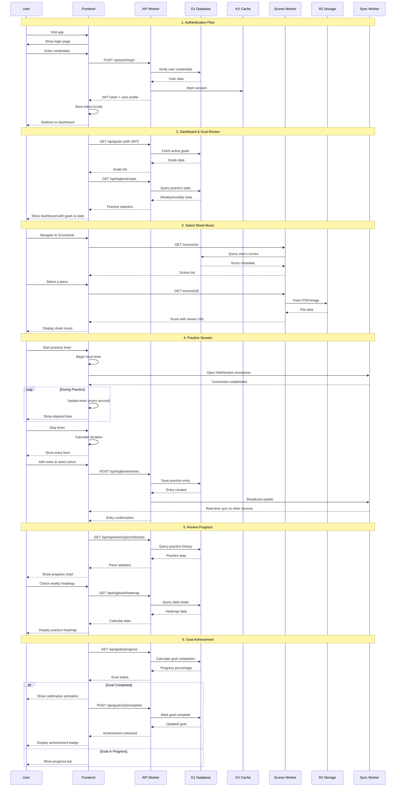
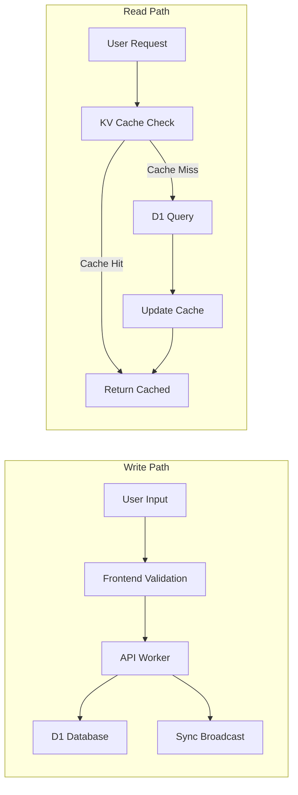

# Mirubato Core Happy Path

## User Journey: From Login to Practice Success

## Key Interaction Patterns

### 1. **Offline-First Architecture**

- Frontend caches data locally using IndexedDB
- WebSocket sync ensures eventual consistency
- Service Workers handle offline mode

### 2. **Real-Time Synchronization**

- WebSocket connection via Sync Worker
- Automatic reconnection with exponential backoff
- Conflict resolution based on timestamps

### 3. **Performance Optimizations**

- KV cache for frequently accessed data (sessions, user preferences)
- R2 CDN for sheet music files
- D1 connection pooling for database queries
- Edge computing via Cloudflare Workers (300+ locations)

### 4. **Data Flow Patterns**

## Success Metrics

The happy path is considered successful when:

1. **Authentication**: < 500ms response time
2. **Dashboard Load**: < 1s for initial data
3. **Sheet Music Display**: < 2s for PDF rendering
4. **Practice Entry Save**: < 300ms with sync confirmation
5. **Real-time Sync**: < 100ms for WebSocket updates
6. **Goal Progress**: Calculated in real-time without page reload

## Error Recovery

Each step includes fallback mechanisms:

- **Network failures**: Retry with exponential backoff
- **Auth failures**: Redirect to login with return URL
- **Sync failures**: Queue changes locally, retry on reconnection
- **PDF load failures**: Show thumbnail with retry option
- **Database errors**: Graceful degradation with cached data

## Mobile Considerations

The happy path adapts for mobile users:

- Touch-optimized UI components
- Reduced data transfer (image compression)
- Offline mode by default
- Background sync when network available
- Responsive layouts for practice timer
