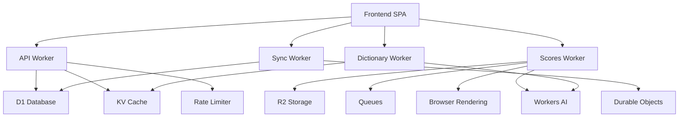

# Cloudflare Services Architecture

## Purpose

This document defines how Mirubato utilizes Cloudflare's edge computing platform, focusing on the "why" behind each service choice and operational patterns rather than implementation details.

## Service Overview

| Service               | Status     | Purpose                         | Primary Users      |
| --------------------- | ---------- | ------------------------------- | ------------------ |
| **Workers**           | ✅ Active  | Edge runtime for all services   | All microservices  |
| **D1**                | ✅ Active  | SQL database at the edge        | API, Sync, Scores  |
| **R2**                | ✅ Active  | Object storage for binaries     | Scores service     |
| **KV**                | ✅ Active  | Edge caching layer              | API, Scores        |
| **Queues**            | ✅ Active  | Async task processing           | Scores service     |
| **Durable Objects**   | ✅ Active  | Stateful WebSocket coordination | Sync service       |
| **Workers AI**        | ✅ Active  | ML inference at edge            | Dictionary, Scores |
| **Browser Rendering** | ✅ Active  | Headless browser operations     | Scores service     |
| **Analytics Engine**  | 🔄 Planned | Custom metrics collection       | Not implemented    |
| **Rate Limiting**     | ✅ Active  | API abuse prevention            | API service        |

---

## Core Services

### Workers

**What**: Edge runtime environment for all Mirubato microservices.

**Why**:

- Sub-50ms global latency through 300+ edge locations
- Zero cold starts with V8 isolates
- Native integration with D1, KV, R2, and other Cloudflare services
- Automatic scaling without configuration

**How**:

- Hono framework for routing and middleware
- TypeScript-first development with direct deployment
- Per-service bindings via wrangler.toml
- CORS and authentication middleware on all routes

**Code References**:

- `api/src/index.ts` — Main API Worker export
- `scores/src/index.ts` — Scores service with queue handler
- `sync-worker/src/index.ts` — WebSocket upgrade handler
- `dictionary/src/index.ts` — Dictionary service with fetch/queue/scheduled handlers

**Operational Limits**:

- CPU time: 50ms per request (paid plan)
- Memory: 128MB per request
- Subrequests: 50 per request
- Script size: 10MB compressed

**Failure Modes**:

- CPU exceeded → 503 error (mitigate with streaming/chunking)
- Memory exceeded → Worker crash (use R2 for large data)
- Subrequest limit → Request fails (batch external calls)

---

### D1 Database

**What**: Edge SQL database for structured application data.

**Why**:

- SQLite at the edge with strong consistency
- No connection management overhead
- Automatic replication across regions
- Zero operational complexity

**How**:

- Prepared statements for all queries
- Batch operations for bulk inserts
- Transaction support for atomic operations
- Migration system per service

**Code References**:

- `api/src/utils/database.ts` — Database helper utilities
- `api/src/api/handlers/repertoire.ts` — Repertoire CRUD operations
- `sync-worker/src/syncCoordinator.ts` — Bulk sync database operations
- `scores/src/queue-consumer.ts` — Background database writes

**Operational Limits**:

- Database size: 2GB (current)
- Query time: 10 seconds max
- Batch size: 100 statements
- Result size: 100MB

**Failure Modes**:

- Query timeout → Retry with simpler query
- Lock contention → Implement retry logic
- Size limit → Archive old data to R2

---

### R2 Object Storage

**What**: Binary object storage for PDFs, images, and generated assets.

**Why**:

- Cost-effective large file storage ($0.015/GB/month)
- Direct Worker integration without egress fees
- Immutable object caching
- Presigned URLs for secure access

**How**:

- Direct put/get operations from Workers
- Timestamp+random filename keys for uploads (versioned prefixes)
- Public serving via Scores worker with caching
- Metadata attached to objects for search

**Code References**:

- `scores/src/services/uploadService.ts` — R2 upload service
- `scores/src/index.ts` — R2 file serving endpoints
- `scores/src/queue-consumer.ts` — PDF storage workflow

**Operational Limits**:

- Object size: 5TB max (we limit to 50MB)
- Request rate: 1000/second per bucket
- Multipart: Required for >100MB

**Failure Modes**:

- Upload timeout → Retry with multipart
- Missing object → Return 404 with fallback
- Quota exceeded → Alert and cleanup old versions

---

### KV Namespace

**What**: Key-value cache for semi-static data and API responses.

**Why**:

- 1ms edge reads globally
- Reduces D1 query load
- Eventually consistent with TTL support
- Simple get/put/delete interface

**How**:

- `MUSIC_CATALOG` for autocomplete and static lists
- `CACHE` namespace for rendered previews
- TTL-based expiration (5-60 minutes typically)
- JSON serialization for complex objects

**Code References**:

- `api/src/utils/cache.ts` — API cache middleware
- `scores/src/utils/cache.ts` — Cache header utilities
- `dictionary/src/services/storage/cache-service.ts` — Cache service class

**Operational Limits**:

- Key size: 512 bytes
- Value size: 25MB
- Operations: 1000/second

**Failure Modes**:

- Stale reads → Use cache headers for versioning
- Write conflicts → Last write wins
- Size exceeded → Chunk or use R2

**Note**: Session storage mentioned in early docs is not implemented; we use JWT tokens instead.

---

### Queues

**What**: Asynchronous task processing for heavy operations.

**Why**:

- Moves slow work off request path
- Automatic retries with exponential backoff
- Dead letter queue for failed messages
- Batching for efficiency

**How**:

- PDF processing queue in Scores service
- Producers send after upload/import
- Consumer processes in batches
- Updates D1 and R2 on completion

**Code References**:

- `scores/src/api/handlers/upload.ts` — Queue producer after upload
- `scores/src/index.ts` — Queue consumer handler
- `scores/src/queue/pdf-processor.ts` — PDF processing logic

**Operational Limits**:

- Message size: 128KB
- Batch size: 100 messages
- Retention: 4 days
- Retries: 3 attempts

**Failure Modes**:

- Processing timeout → Message requeued
- Repeated failures → Dead letter queue
- Queue full → Backpressure to producers

---

### Durable Objects

**What**: Stateful coordination for per-user WebSocket connections.

**Why**:

- Maintains WebSocket state across reconnects
- User-scoped isolation for data privacy
- Automatic hibernation for cost efficiency
- Built-in persistence and alarms

**How**:

- One Durable Object per user ID
- Manages all user's device connections
- Broadcasts sync events to all devices
- Persists changes to D1 for recovery (clients receive recent changes on reconnect)

**Sync Flow**: Client authenticates → Sync worker routes to user-named DO → DO broadcasts and writes to D1 → Client reconnect pulls recent changes.

**Code References**:

- `sync-worker/src/index.ts` — WebSocket upgrade routing
- `sync-worker/src/syncCoordinator.ts` — SyncCoordinator Durable Object
- `sync-worker/src/syncCoordinator.ts` — WebSocket connection management

**Operational Limits**:

- Memory: 128MB per object
- WebSocket connections: 32k per object
- Storage: 50GB per object
- CPU: 30 seconds per request

**Failure Modes**:

- Object eviction → State restored from storage
- Connection limit → Reject new connections
- Hibernation → Automatic wake on message

---

### Workers AI

**What**: Machine learning inference at the edge.

**Why**:

- No external API dependencies
- Low latency inference
- Privacy-preserving (data stays in region)
- Cost-effective per-request pricing

**How**:

- Vision models for score analysis
- Text models for definitions
- Embeddings for semantic search
- Structured output with JSON mode

**Code References**:

- `dictionary/src/services/ai/cloudflare-ai-service.ts` — AI content generation and embeddings
- `scores/src/services/cloudflareAiExtractor.ts` — Score metadata extraction
- `dictionary/src/services/ai/embeddings-service.ts` — Semantic search embeddings

**Operational Limits** (typical, subject to Cloudflare limits):

- Request size: 100KB text, 10MB images
- Timeout: 60 seconds
- Rate limit: 100 requests/minute

**Failure Modes**:

- Model unavailable → Fallback to defaults
- Timeout → Return partial results
- Invalid output → Retry with simpler prompt

---

### Browser Rendering

**What**: Headless browser for PDF operations and web scraping.

**Why**:

- Generate PDF previews without external services
- Scrape IMSLP for metadata
- Render music notation to images
- Process complex PDFs reliably

**How**:

- Two implementation patterns:
  1. Direct `env.BROWSER` for simple renders
  2. Puppeteer for complex PDF analysis
- KV caching for rendered outputs
- Timeout management critical

**Code References**:

- `scores/src/services/browser-rendering.ts` — Browser rendering utilities
- `scores/src/queue/pdf-processor.ts` — PDF processing with Puppeteer

**Operational Limits** (typical, subject to Cloudflare limits):

- Session duration: 60 seconds
- Memory: 2GB
- Concurrent sessions: 2 per worker

**Failure Modes**:

- Timeout → Return cached or placeholder
- Memory exceeded → Restart browser
- Invalid PDF → Mark as unprocessable

---

### Rate Limiting

**What**: API abuse prevention using Cloudflare's native rate limiter.

**Why**:

- Prevent resource exhaustion
- Fair usage enforcement
- DDoS protection
- Per-IP and per-user limits

**How**:

- Native Cloudflare rate limit binding
- Configured in wrangler.toml
- Middleware checks before processing
- Returns 429 on limit exceeded

**Code References**:

- `api/wrangler.toml` — Rate limiter binding configurations
- `api/src/api/middleware.ts` — Rate limit middleware implementation

**Configuration**:

```toml
[[unsafe.bindings]]
name = "RATE_LIMITER"
type = "ratelimit"
namespace_id = "1234"
simple = { limit = 10, period = 60 }
```

**Operational Limits**:

- Configurable per namespace
- IP-based or key-based limiting
- Multiple rules per binding

**Failure Modes**:

- Binding unavailable → Allow request (fail open)
- False positive → User gets 429 error

---

### Analytics Engine (Planned)

**What**: Custom event analytics at the edge.

**Status**: 🔄 **Planned - Not yet implemented**

**Why** (Planned):

- Real-time usage analytics
- Custom business metrics
- No sampling required
- SQL query interface

**How** (Proposed):

- Write data points from Workers
- Query via SQL API
- Aggregate in real-time
- Export to external systems

**Note**: Currently using application logs and D1 for basic analytics. Analytics Engine integration is on the roadmap for advanced metrics.

---

## Service Dependencies



## Cost Optimization

### Current Usage (Free Tier)

- Workers: 100k requests/day free
- D1: 5GB storage free
- R2: 10GB storage free
- KV: 100k reads/day free
- Queues: 1M messages/month free

### Scaling Considerations

- Cache aggressively in KV to reduce D1 reads
- Use R2 for large objects instead of KV
- Batch queue messages to reduce operations
- Enable Durable Object hibernation
- Implement request coalescing

## Migration Path

When adding new Cloudflare services:

1. **Evaluate need**: Document why existing services insufficient
2. **Prototype**: Test in staging environment first
3. **Monitor costs**: Set up billing alerts
4. **Document patterns**: Update this spec with usage
5. **Train team**: Ensure team understands service

## Related Documentation

- [Microservices Architecture](./microservices.md) - Service communication patterns
- [Deployment](./deployment.md) - Wrangler configuration details
- [Performance](../07-operations/performance.md) - Optimization strategies
- [Monitoring](../07-operations/monitoring-debugging.md) - Operational insights

---

_Last updated: December 2024 | Version 1.7.6_
