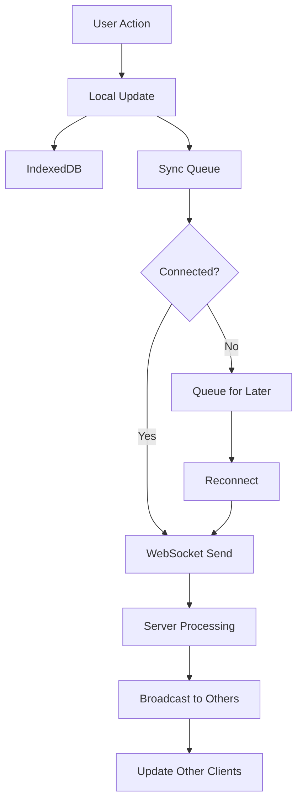

# Data Synchronization Strategy

## Overview

Mirubato implements a sophisticated offline-first synchronization strategy that ensures data consistency across multiple devices while supporting real-time collaboration. The system uses WebSocket connections for instant updates and maintains an offline queue for resilience.

## Synchronization Architecture

### Three-Layer Sync Model

```
┌─────────────────┐
│   Client Layer  │  IndexedDB + Memory Cache
├─────────────────┤
│   Sync Layer    │  WebSocket + Offline Queue
├─────────────────┤
│   Server Layer  │  D1 Database + Durable Objects
└─────────────────┘
```

### Data Flow



## Offline-First Strategy

### Local Data Storage

```typescript
// IndexedDB schema for offline storage
class OfflineStorage {
  private db: IDBDatabase

  async saveEntry(entry: LogbookEntry) {
    // Save to IndexedDB
    const tx = this.db.transaction(['entries'], 'readwrite')
    const store = tx.objectStore('entries')

    // Add sync metadata
    const offlineEntry = {
      ...entry,
      _syncStatus: 'pending',
      _localVersion: Date.now(),
      _syncAttempts: 0,
    }

    await store.put(offlineEntry)

    // Add to sync queue
    await this.queueForSync({
      type: 'entry',
      id: entry.id,
      operation: 'upsert',
      timestamp: Date.now(),
    })
  }

  async getUnsyncedChanges(): Promise<SyncChange[]> {
    const tx = this.db.transaction(['syncQueue'], 'readonly')
    const store = tx.objectStore('syncQueue')
    const index = store.index('status')

    return await index.getAll('pending')
  }
}
```

### Sync Queue Management

```typescript
interface SyncQueueItem {
  id: string
  entityType: 'logbook' | 'repertoire' | 'goals'
  entityId: string
  operation: 'create' | 'update' | 'delete'
  data: any
  timestamp: number
  attempts: number
  lastAttempt?: number
  error?: string
}

class SyncQueue {
  private queue: SyncQueueItem[] = []
  private processing = false

  async add(item: Omit<SyncQueueItem, 'id' | 'attempts'>) {
    const queueItem: SyncQueueItem = {
      ...item,
      id: crypto.randomUUID(),
      attempts: 0,
    }

    this.queue.push(queueItem)
    await this.persist()

    if (!this.processing) {
      this.process()
    }
  }

  async process() {
    if (this.processing || !navigator.onLine) return

    this.processing = true

    while (this.queue.length > 0) {
      const item = this.queue[0]

      try {
        await this.syncItem(item)
        this.queue.shift()
        await this.persist()
      } catch (error) {
        item.attempts++
        item.lastAttempt = Date.now()
        item.error = error.message

        if (item.attempts >= 3) {
          // Move to dead letter queue
          await this.moveToDeadLetter(item)
          this.queue.shift()
        } else {
          // Exponential backoff
          const delay = Math.pow(2, item.attempts) * 1000
          await new Promise(resolve => setTimeout(resolve, delay))
        }
      }
    }

    this.processing = false
  }
}
```

## Real-Time Synchronization

### WebSocket Connection Management

```typescript
class RealtimeSync {
  private ws: WebSocket | null = null
  private reconnectAttempts = 0
  private heartbeatInterval: number | null = null

  async connect() {
    const token = await this.getAuthToken()
    const wsUrl = `${WS_URL}/sync?token=${token}`

    this.ws = new WebSocket(wsUrl)

    this.ws.onopen = () => {
      console.log('WebSocket connected')
      this.reconnectAttempts = 0
      this.startHeartbeat()
      this.syncPendingChanges()
    }

    this.ws.onmessage = event => {
      this.handleMessage(JSON.parse(event.data))
    }

    this.ws.onerror = error => {
      console.error('WebSocket error:', error)
    }

    this.ws.onclose = () => {
      this.stopHeartbeat()
      this.scheduleReconnect()
    }
  }

  private startHeartbeat() {
    this.heartbeatInterval = setInterval(() => {
      if (this.ws?.readyState === WebSocket.OPEN) {
        this.ws.send(JSON.stringify({ type: 'ping' }))
      }
    }, 30000)
  }

  private scheduleReconnect() {
    const delay = Math.min(1000 * Math.pow(2, this.reconnectAttempts), 30000)
    this.reconnectAttempts++

    setTimeout(() => {
      if (this.ws?.readyState !== WebSocket.OPEN) {
        this.connect()
      }
    }, delay)
  }
}
```

### Message Protocol

```typescript
// Client to Server messages
type ClientMessage =
  | { type: 'sync'; data: SyncPayload }
  | { type: 'subscribe'; entities: string[] }
  | { type: 'ping' }

// Server to Client messages
type ServerMessage =
  | { type: 'update'; data: EntityUpdate }
  | { type: 'conflict'; data: ConflictData }
  | { type: 'sync_complete'; timestamp: number }
  | { type: 'pong' }

interface SyncPayload {
  entityType: string
  entityId: string
  operation: 'create' | 'update' | 'delete'
  data: any
  version: number
  clientId: string
}

interface EntityUpdate {
  entityType: string
  entityId: string
  data: any
  version: number
  timestamp: number
  userId: string
}
```

## Conflict Resolution

### Version-Based Conflict Detection

```typescript
interface VersionedEntity {
  id: string
  version: number
  lastModified: number
  hash: string
  data: any
}

class ConflictResolver {
  detectConflict(local: VersionedEntity, remote: VersionedEntity): boolean {
    // Version mismatch indicates potential conflict
    if (local.version !== remote.version - 1) {
      return true
    }

    // Hash comparison for data integrity
    if (local.hash === remote.hash) {
      return false // No actual changes
    }

    // Check if changes are mergeable
    return !this.canAutoMerge(local.data, remote.data)
  }

  canAutoMerge(local: any, remote: any): boolean {
    // Non-overlapping field changes can be merged
    const localFields = Object.keys(local)
    const remoteFields = Object.keys(remote)

    const commonFields = localFields.filter(
      f => remoteFields.includes(f) && local[f] !== remote[f]
    )

    // Auto-merge if no conflicting fields
    return commonFields.length === 0
  }
}
```

### Resolution Strategies

```typescript
enum ResolutionStrategy {
  LOCAL_WINS = 'local', // Keep local changes
  REMOTE_WINS = 'remote', // Accept server changes
  MERGE = 'merge', // Merge non-conflicting changes
  MANUAL = 'manual', // User decides
}

class ConflictResolution {
  async resolve(
    conflict: ConflictData,
    strategy: ResolutionStrategy
  ): Promise<any> {
    switch (strategy) {
      case ResolutionStrategy.LOCAL_WINS:
        return this.keepLocal(conflict)

      case ResolutionStrategy.REMOTE_WINS:
        return this.acceptRemote(conflict)

      case ResolutionStrategy.MERGE:
        return this.mergeChanges(conflict)

      case ResolutionStrategy.MANUAL:
        return this.promptUser(conflict)
    }
  }

  private mergeChanges(conflict: ConflictData) {
    const { local, remote, base } = conflict

    // Three-way merge
    const merged = { ...base }

    // Apply non-conflicting local changes
    for (const [key, value] of Object.entries(local)) {
      if (base[key] !== value && remote[key] === base[key]) {
        merged[key] = value
      }
    }

    // Apply non-conflicting remote changes
    for (const [key, value] of Object.entries(remote)) {
      if (base[key] !== value && local[key] === base[key]) {
        merged[key] = value
      }
    }

    // For conflicts, use resolution rules
    for (const [key, value] of Object.entries(local)) {
      if (
        local[key] !== remote[key] &&
        local[key] !== base[key] &&
        remote[key] !== base[key]
      ) {
        merged[key] = this.resolveField(key, local[key], remote[key])
      }
    }

    return merged
  }

  private resolveField(field: string, local: any, remote: any): any {
    // Field-specific resolution rules
    switch (field) {
      case 'notes':
        // Concatenate notes
        return `${local}\n\n---\n\n${remote}`

      case 'duration':
        // Take the larger duration
        return Math.max(local, remote)

      case 'tags':
        // Merge arrays
        return [...new Set([...local, ...remote])]

      default:
        // Last write wins
        return remote
    }
  }
}
```

## Sync Optimization

### Differential Sync

```typescript
class DifferentialSync {
  private lastSyncVersion: Map<string, number> = new Map()

  async getChangedEntities(since: number): Promise<EntityChange[]> {
    const changes: EntityChange[] = []

    // Get all entities modified since last sync
    const entities = await db.entries.where('updatedAt').above(since).toArray()

    for (const entity of entities) {
      const lastVersion = this.lastSyncVersion.get(entity.id) || 0

      if (entity.version > lastVersion) {
        changes.push({
          id: entity.id,
          type: this.getChangeType(entity),
          data: this.getDiff(entity, lastVersion),
          version: entity.version,
        })
      }
    }

    return changes
  }

  private getDiff(entity: any, fromVersion: number): any {
    // Return only changed fields
    const previous = this.getPreviousVersion(entity.id, fromVersion)
    const diff: any = {}

    for (const [key, value] of Object.entries(entity)) {
      if (previous[key] !== value) {
        diff[key] = value
      }
    }

    return diff
  }
}
```

### Batch Synchronization

```typescript
class BatchSync {
  private batchSize = 50
  private batchDelay = 100 // ms
  private pendingBatch: SyncItem[] = []
  private batchTimer: number | null = null

  async queueSync(item: SyncItem) {
    this.pendingBatch.push(item)

    if (this.pendingBatch.length >= this.batchSize) {
      await this.flushBatch()
    } else if (!this.batchTimer) {
      this.batchTimer = setTimeout(() => {
        this.flushBatch()
      }, this.batchDelay)
    }
  }

  private async flushBatch() {
    if (this.pendingBatch.length === 0) return

    const batch = this.pendingBatch.splice(0, this.batchSize)

    try {
      await this.sendBatch(batch)
    } catch (error) {
      // Re-queue failed items
      this.pendingBatch.unshift(...batch)
    }

    if (this.batchTimer) {
      clearTimeout(this.batchTimer)
      this.batchTimer = null
    }
  }

  private async sendBatch(items: SyncItem[]) {
    const response = await fetch('/api/sync/batch', {
      method: 'POST',
      headers: {
        'Content-Type': 'application/json',
        Authorization: `Bearer ${this.token}`,
      },
      body: JSON.stringify({ items }),
    })

    if (!response.ok) {
      throw new Error('Batch sync failed')
    }

    const results = await response.json()
    this.processBatchResults(results)
  }
}
```

## Data Consistency

### Eventual Consistency Model

```typescript
class EventualConsistency {
  // Guarantee eventual consistency through:
  // 1. Idempotent operations
  // 2. Commutative updates
  // 3. Convergent data types

  async applyUpdate(update: Update): Promise<void> {
    // Idempotent - can be applied multiple times safely
    const existing = await this.getEntity(update.id)

    if (existing && existing.version >= update.version) {
      return // Already applied
    }

    // Apply update
    await this.saveEntity({
      ...existing,
      ...update.data,
      version: update.version,
    })

    // Track applied updates
    await this.markApplied(update.id, update.version)
  }

  // Commutative operations
  incrementCounter(id: string, delta: number) {
    // Order doesn't matter: +3 then +2 = +2 then +3
    return this.updateEntity(id, {
      $inc: { count: delta },
    })
  }

  // Convergent data type (CRDT)
  mergeSets(id: string, items: string[]) {
    // Sets naturally converge through union
    return this.updateEntity(id, {
      $addToSet: { items: { $each: items } },
    })
  }
}
```

### Consistency Guarantees

| Level        | Description                         | Implementation                     |
| ------------ | ----------------------------------- | ---------------------------------- |
| **Strong**   | All clients see same data instantly | Not supported (distributed system) |
| **Eventual** | All clients converge to same state  | Primary guarantee                  |
| **Causal**   | Related updates maintain order      | Via version vectors                |
| **Session**  | User sees own writes                | Local cache priority               |

## Performance Optimization

### Sync Throttling

```typescript
class SyncThrottler {
  private syncInterval = 30000 // 30 seconds
  private immediateTypes = ['logbook'] // Sync immediately
  private lastSync: Map<string, number> = new Map()

  shouldSyncNow(entityType: string): boolean {
    if (this.immediateTypes.includes(entityType)) {
      return true
    }

    const last = this.lastSync.get(entityType) || 0
    const elapsed = Date.now() - last

    return elapsed >= this.syncInterval
  }

  async throttledSync(entityType: string, data: any) {
    if (this.shouldSyncNow(entityType)) {
      await this.syncImmediately(entityType, data)
      this.lastSync.set(entityType, Date.now())
    } else {
      await this.queueForLaterSync(entityType, data)
    }
  }
}
```

### Selective Sync

```typescript
class SelectiveSync {
  // Only sync what's needed
  async syncEntity(entity: Entity) {
    const syncPayload = this.minimizePayload(entity)

    // Skip unchanged data
    if (!this.hasChanges(entity)) {
      return
    }

    // Compress large fields
    if (entity.notes && entity.notes.length > 1000) {
      syncPayload.notes = await this.compress(entity.notes)
    }

    await this.send(syncPayload)
  }

  private minimizePayload(entity: Entity): any {
    // Only send changed fields
    const changes = this.getChangedFields(entity)

    return {
      id: entity.id,
      version: entity.version,
      changes,
    }
  }
}
```

## Monitoring & Debugging

### Sync Metrics

```typescript
interface SyncMetrics {
  totalSyncs: number
  successfulSyncs: number
  failedSyncs: number
  conflicts: number
  averageLatency: number
  queueSize: number
  lastSyncTime: number
}

class SyncMonitor {
  private metrics: SyncMetrics = {
    totalSyncs: 0,
    successfulSyncs: 0,
    failedSyncs: 0,
    conflicts: 0,
    averageLatency: 0,
    queueSize: 0,
    lastSyncTime: 0,
  }

  trackSync(success: boolean, latency: number) {
    this.metrics.totalSyncs++

    if (success) {
      this.metrics.successfulSyncs++
    } else {
      this.metrics.failedSyncs++
    }

    // Update average latency
    this.metrics.averageLatency =
      (this.metrics.averageLatency * (this.metrics.totalSyncs - 1) + latency) /
      this.metrics.totalSyncs

    this.metrics.lastSyncTime = Date.now()
  }

  getHealthStatus(): 'healthy' | 'degraded' | 'unhealthy' {
    const successRate = this.metrics.successfulSyncs / this.metrics.totalSyncs

    if (successRate > 0.95) return 'healthy'
    if (successRate > 0.8) return 'degraded'
    return 'unhealthy'
  }
}
```

## Related Documentation

- [WebSocket Protocol](../03-api/websocket.md) - Real-time communication
- [Database Schema](./schema.md) - Data structures
- [State Management](../04-frontend/state-management.md) - Client-side state
- [Migrations](./migrations.md) - Database versioning

---

_Last updated: December 2024 | Version 1.7.6_
