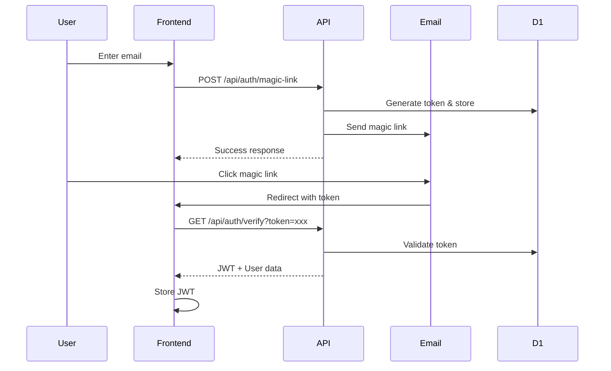

# Authentication Specification

## Overview

Mirubato implements multiple authentication methods to provide flexible and secure access: magic links, Google OAuth, and traditional email/password. All methods generate JWT tokens for API access.

## Authentication Methods

### 1. Magic Link Authentication

Email-based passwordless authentication for enhanced security.

#### Flow



#### Implementation

```typescript
// Token generation
const magicToken = crypto.randomUUID()
const hashedToken = await hashToken(magicToken)
const expiresAt = Date.now() + 15 * 60 * 1000 // 15 minutes

// Store in D1
await env.DB.prepare(
  `
  INSERT INTO magic_links (email, token, expires_at)
  VALUES (?, ?, ?)
`
)
  .bind(email, hashedToken, expiresAt)
  .run()

// Email template
const magicLink = `${env.FRONTEND_URL}/auth/verify?token=${magicToken}`
```

### 2. Google OAuth

Integration with Google Sign-In for seamless authentication.

#### Configuration

```typescript
// Frontend: Google Sign-In button
<GoogleLogin
  clientId={GOOGLE_CLIENT_ID}
  onSuccess={handleGoogleLogin}
  onError={handleError}
/>

// Backend: Token verification
import { OAuth2Client } from 'google-auth-library'
const client = new OAuth2Client(env.GOOGLE_CLIENT_ID)

async function verifyGoogleToken(idToken: string) {
  const ticket = await client.verifyIdToken({
    idToken,
    audience: env.GOOGLE_CLIENT_ID,
  })
  return ticket.getPayload()
}
```

#### User Creation/Update

```typescript
// Check if user exists
const existingUser = await findUserByEmail(googleUser.email)

if (!existingUser) {
  // Create new user
  const newUser = await createUser({
    email: googleUser.email,
    displayName: googleUser.name,
    avatarUrl: googleUser.picture,
    provider: 'google',
    providerId: googleUser.sub,
  })
  return { user: newUser, isNewUser: true }
}

// Update existing user
await updateUser(existingUser.id, {
  lastLoginAt: Date.now(),
  avatarUrl: googleUser.picture,
})
return { user: existingUser, isNewUser: false }
```

### 3. Email/Password (Traditional)

Standard authentication with secure password handling.

#### Password Security

```typescript
// Hashing with Argon2
import { hash, verify } from '@node-rs/argon2'

// Registration
const hashedPassword = await hash(password, {
  memoryCost: 19456,
  timeCost: 2,
  outputLen: 32,
  parallelism: 1,
})

// Login verification
const isValid = await verify(hashedPassword, inputPassword)
```

## JWT Token Management

### Token Structure

```typescript
interface JWTPayload {
  sub: string // User ID
  email: string
  role: 'user' | 'admin'
  iat: number // Issued at
  exp: number // Expires at
  jti: string // JWT ID for revocation
}

// Token generation
const payload: JWTPayload = {
  sub: user.id,
  email: user.email,
  role: user.role,
  iat: Math.floor(Date.now() / 1000),
  exp: Math.floor(Date.now() / 1000) + 3600, // 1 hour
  jti: crypto.randomUUID(),
}

const token = await new SignJWT(payload)
  .setProtectedHeader({ alg: 'HS256' })
  .sign(secret)
```

### Token Validation

```typescript
// Middleware for protected routes
export async function validateJWT(request: Request, env: Env) {
  const authHeader = request.headers.get('Authorization')
  if (!authHeader?.startsWith('Bearer ')) {
    throw new UnauthorizedError('Missing token')
  }

  const token = authHeader.substring(7)

  try {
    const { payload } = await jwtVerify(token, env.JWT_SECRET)

    // Check if token is revoked
    const revoked = await env.KV.get(`revoked:${payload.jti}`)
    if (revoked) {
      throw new UnauthorizedError('Token revoked')
    }

    return payload as JWTPayload
  } catch (error) {
    throw new UnauthorizedError('Invalid token')
  }
}
```

## Refresh Token Strategy

### Token Rotation

```typescript
interface RefreshToken {
  id: string
  userId: string
  token: string
  family: string // Token family for detecting reuse
  expiresAt: number // 30 days
  usedAt?: number // Track usage
}

// Generate refresh token pair
async function generateTokenPair(user: User) {
  const accessToken = await generateJWT(user, '1h')
  const refreshToken = crypto.randomUUID()
  const family = crypto.randomUUID()

  // Store refresh token
  await env.DB.prepare(
    `
    INSERT INTO refresh_tokens (user_id, token, family, expires_at)
    VALUES (?, ?, ?, ?)
  `
  )
    .bind(user.id, hashToken(refreshToken), family, Date.now() + 30 * 86400000)
    .run()

  return { accessToken, refreshToken }
}

// Refresh endpoint
async function refreshAccessToken(refreshToken: string) {
  const hashedToken = hashToken(refreshToken)
  const tokenRecord = await findRefreshToken(hashedToken)

  if (!tokenRecord || tokenRecord.expiresAt < Date.now()) {
    throw new UnauthorizedError('Invalid refresh token')
  }

  // Check for token reuse (security breach)
  if (tokenRecord.usedAt) {
    // Revoke entire token family
    await revokeTokenFamily(tokenRecord.family)
    throw new SecurityError('Token reuse detected')
  }

  // Mark as used
  await markTokenUsed(tokenRecord.id)

  // Generate new pair with same family
  const user = await findUserById(tokenRecord.userId)
  return generateTokenPair(user)
}
```

## Session Management

### Active Sessions

```typescript
interface Session {
  id: string
  userId: string
  deviceInfo: string
  ipAddress: string
  userAgent: string
  createdAt: number
  lastActivityAt: number
  expiresAt: number
}

// Track sessions
async function createSession(user: User, request: Request) {
  const session = {
    id: crypto.randomUUID(),
    userId: user.id,
    deviceInfo: parseUserAgent(request.headers.get('User-Agent')),
    ipAddress: request.headers.get('CF-Connecting-IP'),
    userAgent: request.headers.get('User-Agent'),
    createdAt: Date.now(),
    lastActivityAt: Date.now(),
    expiresAt: Date.now() + 7 * 86400000, // 7 days
  }

  await env.DB.prepare(
    `
    INSERT INTO sessions (id, user_id, device_info, ip_address, user_agent, created_at, last_activity_at, expires_at)
    VALUES (?, ?, ?, ?, ?, ?, ?, ?)
  `
  )
    .bind(...Object.values(session))
    .run()

  return session
}
```

### Session Invalidation

```typescript
// Logout single session
async function logout(sessionId: string) {
  await env.DB.prepare(
    `
    DELETE FROM sessions WHERE id = ?
  `
  )
    .bind(sessionId)
    .run()

  // Revoke associated tokens
  await revokeSessionTokens(sessionId)
}

// Logout all sessions
async function logoutAll(userId: string) {
  await env.DB.prepare(
    `
    DELETE FROM sessions WHERE user_id = ?
  `
  )
    .bind(userId)
    .run()

  // Revoke all user tokens
  await revokeUserTokens(userId)
}
```

## Security Measures

### Rate Limiting

```typescript
// Login attempts
const loginAttempts = (await env.KV.get(`login:${email}`, 'json')) || {
  count: 0,
  resetAt: 0,
}

if (loginAttempts.count >= 5 && loginAttempts.resetAt > Date.now()) {
  throw new TooManyRequestsError('Too many login attempts')
}

// Increment on failure
await env.KV.put(
  `login:${email}`,
  JSON.stringify({
    count: loginAttempts.count + 1,
    resetAt: Date.now() + 15 * 60 * 1000, // 15 minutes
  }),
  { expirationTtl: 900 }
)
```

### CSRF Protection

```typescript
// Generate CSRF token
const csrfToken = crypto.randomUUID()
await env.KV.put(`csrf:${sessionId}`, csrfToken, { expirationTtl: 3600 })

// Validate CSRF token
const expectedToken = await env.KV.get(`csrf:${sessionId}`)
if (requestToken !== expectedToken) {
  throw new ForbiddenError('Invalid CSRF token')
}
```

### Account Security

```typescript
// Two-factor authentication preparation (future)
interface TwoFactorAuth {
  userId: string
  secret: string
  backupCodes: string[]
  enabled: boolean
}

// Password reset flow
async function initiatePasswordReset(email: string) {
  const resetToken = crypto.randomUUID()
  const expiresAt = Date.now() + 60 * 60 * 1000 // 1 hour

  await env.DB.prepare(
    `
    INSERT INTO password_resets (email, token, expires_at)
    VALUES (?, ?, ?)
  `
  )
    .bind(email, hashToken(resetToken), expiresAt)
    .run()

  await sendPasswordResetEmail(email, resetToken)
}
```

## API Endpoints

### Authentication Endpoints

| Method | Endpoint                 | Description             |
| ------ | ------------------------ | ----------------------- |
| POST   | /api/auth/login          | Email/password login    |
| POST   | /api/auth/register       | Create new account      |
| POST   | /api/auth/magic-link     | Send magic link         |
| GET    | /api/auth/verify         | Verify magic link       |
| POST   | /api/auth/google         | Google OAuth login      |
| POST   | /api/auth/refresh        | Refresh access token    |
| POST   | /api/auth/logout         | Logout current session  |
| POST   | /api/auth/logout-all     | Logout all sessions     |
| POST   | /api/auth/reset-password | Initiate password reset |
| POST   | /api/auth/confirm-reset  | Confirm password reset  |

## Error Handling

### Authentication Errors

```typescript
class AuthenticationError extends Error {
  constructor(
    message: string,
    public code: string,
    public statusCode: number
  ) {
    super(message)
  }
}

// Common auth errors
const errors = {
  INVALID_CREDENTIALS: new AuthenticationError(
    'Invalid email or password',
    'INVALID_CREDENTIALS',
    401
  ),
  TOKEN_EXPIRED: new AuthenticationError(
    'Token has expired',
    'TOKEN_EXPIRED',
    401
  ),
  TOKEN_INVALID: new AuthenticationError('Invalid token', 'TOKEN_INVALID', 401),
  USER_NOT_FOUND: new AuthenticationError(
    'User not found',
    'USER_NOT_FOUND',
    404
  ),
  EMAIL_IN_USE: new AuthenticationError(
    'Email already registered',
    'EMAIL_IN_USE',
    409
  ),
  TOO_MANY_ATTEMPTS: new AuthenticationError(
    'Too many attempts',
    'TOO_MANY_ATTEMPTS',
    429
  ),
}
```

## Related Documentation

- [REST API](./rest-api.md) - Core API patterns
- [WebSocket](./websocket.md) - Real-time authentication
- [Database Schema](../02-database/schema.md) - Auth tables
- [Security](../07-operations/security.md) - Security best practices

---

_Last updated: December 2024 | Version 1.7.6_
