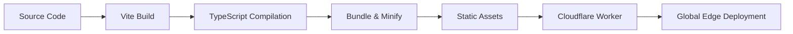

# Frontend Architecture Specification

## Overview

Mirubato's frontend is a React-based single-page application built with TypeScript and modern web technologies. It emphasizes offline-first functionality, responsive design, and optimal performance through edge deployment on Cloudflare Workers.

## Technology Stack

### Core Technologies

| Technology   | Version | Purpose                               |
| ------------ | ------- | ------------------------------------- |
| React        | 18.3.1  | UI framework with concurrent features |
| TypeScript   | 5.7.2   | Type safety and developer experience  |
| Vite         | 6.0.5   | Build tool and dev server             |
| Tailwind CSS | 3.4.17  | Utility-first styling                 |
| Zustand      | 5.0.2   | State management                      |
| React Router | 7.1.1   | Client-side routing                   |
| React Query  | 5.62.11 | Server state management               |
| IndexedDB    | Native  | Offline data storage                  |

### Key Libraries

```json
{
  "dependencies": {
    "@tanstack/react-query": "^5.62.11",
    "react-i18next": "^15.0.0",
    "react-hook-form": "^7.54.2",
    "chart.js": "^4.4.8",
    "date-fns": "^4.1.0",
    "lucide-react": "^0.468.0",
    "react-hot-toast": "^2.4.1",
    "clsx": "^2.1.1"
  }
}
```

## Project Structure

```
frontendv2/
├── src/
│   ├── index.js              # Cloudflare Worker entry
│   ├── main.tsx              # React app entry
│   ├── App.tsx               # Root component
│   ├── router.tsx            # Route definitions
│   │
│   ├── components/           # React components
│   │   ├── ui/              # Base UI components
│   │   ├── layout/          # Layout components
│   │   ├── logbook/         # Logbook features
│   │   ├── scorebook/       # Sheet music features
│   │   ├── repertoire/      # Repertoire features
│   │   ├── goals/           # Goals features
│   │   └── shared/          # Shared components
│   │
│   ├── hooks/               # Custom React hooks
│   │   ├── useAuth.ts
│   │   ├── useWebSocket.ts
│   │   ├── useOffline.ts
│   │   └── useMediaQuery.ts
│   │
│   ├── stores/              # Zustand stores
│   │   ├── authStore.ts
│   │   ├── logbookStore.ts
│   │   ├── repertoireStore.ts
│   │   ├── goalsStore.ts
│   │   ├── settingsStore.ts
│   │   └── syncStore.ts
│   │
│   ├── services/            # API & external services
│   │   ├── api/
│   │   ├── websocket/
│   │   ├── indexeddb/
│   │   └── auth/
│   │
│   ├── utils/               # Utility functions
│   │   ├── date.ts
│   │   ├── format.ts
│   │   ├── validation.ts
│   │   └── constants.ts
│   │
│   ├── locales/             # i18n translations
│   │   ├── en/
│   │   ├── es/
│   │   ├── fr/
│   │   ├── de/
│   │   ├── zh-CN/
│   │   └── zh-TW/
│   │
│   └── styles/              # Global styles
│       ├── globals.css
│       └── typography.css
│
├── public/                  # Static assets
├── dist/                    # Build output
└── tests/                   # Test files
```

## Build & Deployment

### Build Process



### Vite Configuration

```typescript
// vite.config.ts
export default defineConfig({
  plugins: [react(), splitVendorChunkPlugin()],
  build: {
    target: 'es2020',
    outDir: 'dist',
    sourcemap: true,
    rollupOptions: {
      output: {
        manualChunks: {
          'react-vendor': ['react', 'react-dom', 'react-router-dom'],
          'ui-vendor': ['@tanstack/react-query', 'zustand', 'react-hook-form'],
          'chart-vendor': ['chart.js', 'react-chartjs-2'],
        },
      },
    },
  },
  optimizeDeps: {
    include: ['react', 'react-dom'],
  },
})
```

### Cloudflare Worker Wrapper

```javascript
// src/index.js - Serves the SPA
export default {
  async fetch(request, env) {
    const url = new URL(request.url)

    // API proxy for local development
    if (url.pathname.startsWith('/api/')) {
      return fetch(env.API_URL + url.pathname, request)
    }

    // Serve static assets with caching
    if (url.pathname.match(/\.(js|css|png|jpg|svg|woff2?)$/)) {
      const response = await env.ASSETS.fetch(request)
      const headers = new Headers(response.headers)
      headers.set('Cache-Control', 'public, max-age=31536000, immutable')
      return new Response(response.body, { ...response, headers })
    }

    // SPA routing - always return index.html
    const asset = await env.ASSETS.fetch(
      new Request(url.origin + '/index.html')
    )
    return new Response(asset.body, {
      headers: {
        'Content-Type': 'text/html; charset=utf-8',
        'Cache-Control': 'no-cache',
      },
    })
  },
}
```

## Routing Architecture

### Route Structure

```typescript
// router.tsx
export const router = createBrowserRouter([
  {
    path: '/',
    element: <AppLayout />,
    errorElement: <ErrorBoundary />,
    children: [
      { index: true, element: <Dashboard /> },
      { path: 'logbook', element: <LogbookPage /> },
      { path: 'scorebook', element: <ScorebookPage /> },
      { path: 'repertoire', element: <RepertoirePage /> },
      { path: 'goals', element: <GoalsPage /> },
      { path: 'toolbox', element: <ToolboxPage /> },
      { path: 'profile', element: <ProfilePage /> },
    ],
  },
  {
    path: '/auth',
    element: <AuthLayout />,
    children: [
      { path: 'login', element: <LoginPage /> },
      { path: 'verify', element: <VerifyPage /> },
      { path: 'reset', element: <ResetPage /> },
    ],
  },
])
```

### Protected Routes

```typescript
function ProtectedRoute({ children }: { children: React.ReactNode }) {
  const { isAuthenticated, isLoading } = useAuth()
  const location = useLocation()

  if (isLoading) return <LoadingScreen />

  if (!isAuthenticated) {
    return <Navigate to="/auth/login" state={{ from: location }} replace />
  }

  return <>{children}</>
}
```

## Component Architecture

### Component Hierarchy

```
App
├── Router
│   ├── AppLayout
│   │   ├── TopBar / MobileHeader
│   │   ├── Sidebar / BottomTabs
│   │   └── MainContent
│   │       └── Page Components
│   └── AuthLayout
│       └── Auth Components
└── Providers
    ├── QueryClientProvider
    ├── I18nProvider
    ├── ThemeProvider
    └── ToastProvider
```

### Component Patterns

#### 1. Compound Components

```typescript
// Example: Card compound component
export const Card = ({ children, className }: CardProps) => (
  <div className={cn('rounded-lg border bg-card', className)}>
    {children}
  </div>
)

Card.Header = ({ children }: CardSectionProps) => (
  <div className="p-6 pb-0">{children}</div>
)

Card.Content = ({ children }: CardSectionProps) => (
  <div className="p-6">{children}</div>
)

Card.Footer = ({ children }: CardSectionProps) => (
  <div className="p-6 pt-0">{children}</div>
)
```

#### 2. Render Props

```typescript
function DataProvider<T>({
  query,
  children
}: {
  query: () => Promise<T>,
  children: (data: T) => ReactNode
}) {
  const { data, isLoading, error } = useQuery({ queryKey: ['data'], queryFn: query })

  if (isLoading) return <Loading />
  if (error) return <Error error={error} />

  return <>{children(data)}</>
}
```

#### 3. Custom Hooks

```typescript
// Encapsulate complex logic in hooks
function useLogbookEntry(id: string) {
  const queryClient = useQueryClient()

  const query = useQuery({
    queryKey: ['logbook', id],
    queryFn: () => api.getLogbookEntry(id),
  })

  const mutation = useMutation({
    mutationFn: (data: Partial<LogbookEntry>) =>
      api.updateLogbookEntry(id, data),
    onSuccess: () => {
      queryClient.invalidateQueries({ queryKey: ['logbook'] })
    },
  })

  return { ...query, update: mutation.mutate }
}
```

## Performance Optimization

### Code Splitting

```typescript
// Lazy load heavy components
const ChartView = lazy(() => import('./components/analytics/ChartView'))
const PDFViewer = lazy(() => import('./components/scorebook/PDFViewer'))
const MetronomeApp = lazy(() => import('./components/toolbox/Metronome'))

// Route-based splitting
const routes = [
  {
    path: 'analytics',
    element: (
      <Suspense fallback={<Loading />}>
        <ChartView />
      </Suspense>
    ),
  },
]
```

### React Query Optimization

```typescript
// Prefetching
const prefetchLogbook = async () => {
  await queryClient.prefetchQuery({
    queryKey: ['logbook'],
    queryFn: api.getLogbookEntries,
    staleTime: 5 * 60 * 1000, // 5 minutes
  })
}

// Optimistic updates
const mutation = useMutation({
  mutationFn: api.updateEntry,
  onMutate: async newData => {
    await queryClient.cancelQueries({ queryKey: ['logbook'] })
    const previousData = queryClient.getQueryData(['logbook'])
    queryClient.setQueryData(['logbook'], old => ({
      ...old,
      ...newData,
    }))
    return { previousData }
  },
  onError: (err, newData, context) => {
    queryClient.setQueryData(['logbook'], context.previousData)
  },
})
```

### Bundle Optimization

```typescript
// Tree shaking with ES modules
import { format } from 'date-fns/format' // ✅ Only import what's needed
// import * as dateFns from 'date-fns' // ❌ Imports entire library

// Dynamic imports for large libraries
const loadChartJS = async () => {
  const { Chart } = await import('chart.js/auto')
  return Chart
}
```

## PWA Configuration

### Service Worker

```javascript
// sw.js
self.addEventListener('install', event => {
  event.waitUntil(
    caches.open('v1').then(cache => {
      return cache.addAll([
        '/',
        '/index.html',
        '/manifest.json',
        '/assets/app.js',
        '/assets/app.css',
      ])
    })
  )
})

self.addEventListener('fetch', event => {
  event.respondWith(
    caches.match(event.request).then(response => {
      return response || fetch(event.request)
    })
  )
})
```

### Manifest

```json
{
  "name": "Mirubato Music Practice",
  "short_name": "Mirubato",
  "icons": [
    {
      "src": "/icon-192.png",
      "sizes": "192x192",
      "type": "image/png"
    },
    {
      "src": "/icon-512.png",
      "sizes": "512x512",
      "type": "image/png"
    }
  ],
  "start_url": "/",
  "display": "standalone",
  "theme_color": "#818f6d",
  "background_color": "#fafaf8"
}
```

## Development Workflow

### Local Development

```bash
# Start development server
pnpm run dev

# Type checking
pnpm run type-check

# Linting
pnpm run lint

# Testing
pnpm test

# Build for production
pnpm run build
```

### Environment Configuration

```typescript
// env.d.ts
interface ImportMetaEnv {
  readonly VITE_API_URL: string
  readonly VITE_WS_URL: string
  readonly VITE_GOOGLE_CLIENT_ID: string
  readonly VITE_ENVIRONMENT: 'local' | 'staging' | 'production'
}

interface ImportMeta {
  readonly env: ImportMetaEnv
}
```

## Testing Strategy

### Unit Testing

```typescript
// Component testing with Vitest
describe('LogbookEntry', () => {
  it('should render entry details', () => {
    const entry = mockLogbookEntry()
    const { getByText } = render(<LogbookEntry entry={entry} />)
    expect(getByText(entry.notes)).toBeInTheDocument()
  })
})
```

### Integration Testing

```typescript
// API integration tests
describe('Logbook API', () => {
  it('should create and fetch entry', async () => {
    const entry = await api.createEntry(mockData)
    const fetched = await api.getEntry(entry.id)
    expect(fetched).toEqual(entry)
  })
})
```

### E2E Testing

```typescript
// Playwright E2E tests
test('complete practice session', async ({ page }) => {
  await page.goto('/logbook')
  await page.click('[data-testid="new-entry"]')
  await page.fill('[name="duration"]', '30')
  await page.click('[data-testid="save"]')
  await expect(page.locator('[data-testid="entry-list"]')).toContainText(
    '30 min'
  )
})
```

## Related Documentation

- [State Management](./state-management.md) - Zustand store architecture
- [Components](./components.md) - Component library documentation
- [UI Design System](./ui-design-system.md) - Design tokens and patterns
- [Responsive Design](./responsive-design.md) - Mobile-first approach
- [Layout Patterns](./layout-patterns.md) - Layout system

---

_Last updated: December 2024 | Version 1.7.6_
